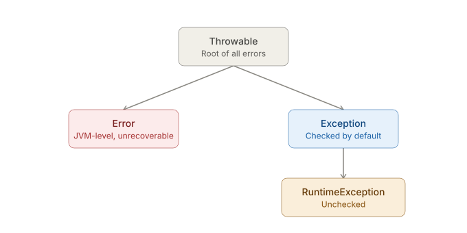
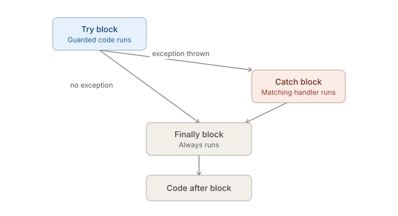

# Exceptions
- An exception is just an ordinary object — an instance of a class that extends `Throwable` — that represents "something went wrong." 
- When code encounters a problem it can't handle locally, it constructs one of these objects and throws it, which immediately stops normal execution, looking for a matching catch block, until one is found or the program terminates.

## The hierarchy


### Checked vs. unchecked — the distinction that actually matters
- Error — represents problems the JVM itself runs into (OutOfMemoryError, StackOverflowError) — not meant to be caught or recovered from by application code; catching Error is legal (it's a Throwable) but almost never the right move.
- Checked exceptions — any `Exception` subclass that is not a `RuntimeException` (e.g. `IOException`, `SQLException`). The compiler forces you to either catch it or declare it in the method signature with `throws` — a missing handling path is a compile error, not a runtime surprise. These represent problems a well-written program is expected to anticipate and plan for (a file might not exist, a network call might fail).
- Unchecked exceptions (RuntimeException and its subclasses) — `NullPointerException`, `ArrayIndexOutOfBoundsException`, `IllegalArgumentException`, `ClassCastException`. The compiler does not force you to catch or declare these — they typically represent programming bugs (a logic error, an invalid argument) rather than expected external failure conditions, so forcing every method up the call chain to declare them would be noise, not safety.

### The exact mechanical rule for "checked"
- The compiler determines checked-ness purely by inheritance, not by any keyword or annotation — if a class's ancestor chain reaches Exception without passing through RuntimeException, it's checked; if it passes through RuntimeException anywhere, it's unchecked, no matter how many subclasses deep.

### try-catch-finally execution flow


- The only time `finally` gets skipped is upon a `System.exit()` method call. Or the JVM getting crashed.

### Multi-catch and catch ordering
```java
try {
    processTransfer(from, to, amount);
} catch (InsufficientFundsException | AccountFrozenException e) {   // multi-catch, Java 7+
    log(e.getMessage());
} catch (TransferException e) {
    log("General transfer failure: " + e.getMessage());
}
```

- Multi-catch (`|`) — one block handling several unrelated exception types identically; the caught variable (e) is implicitly final, and the listed types must not be related by inheritance (listing both a class and its own subclass is a compile error — redundant).
- Ordering rule: catch blocks are checked top-to-bottom, first match wins. A more general type must never appear before a more specific one — `catch (Exception e)` before `catch (InsufficientFundsException e)` makes the second block unreachable code, which is a compile error, not just a style warning.


### Custom exceptions — the standard pattern
```java
class InsufficientFundsException extends Exception {           // checked — caller must handle
    public InsufficientFundsException(String message) {
        super(message);
    }
}

class AccountFrozenException extends RuntimeException {        // unchecked — a programming/business-rule violation
    public AccountFrozenException(String message) {
        super(message);
    }
}
```

- Extending `Exception` vs `RuntimeException` is the entire decision point for checked vs. unchecked — there's no separate keyword, it's purely which ancestor you pick. 
- Constructors typically just forward to `Throwable`'s constructors (super(message), or super(message, cause) for exception chaining below).

### Exception chaining
```java
try {
    accountRepository.save(account);
} catch (SQLException e) {
    throw new TransferException("Could not persist transfer", e);   // 'e' becomes the "cause"
}
```
Throwable has a `getCause()` method and constructors accepting a cause parameter specifically so that we can pass the original exception without losing the original stack trace — `e.printStackTrace()` will show the full chain ("Caused by: ..."), which is essential for real debugging. 
Throwing a new exception without chaining the original is a common anti-pattern that destroys diagnostic information.

### Throw versus throws 
## `throw` vs `throws`

| Keyword  | Meaning                                                                                                            |
|----------|--------------------------------------------------------------------------------------------------------------------|
| `throw`  | A statement — actually throws a specific exception instance **right now, at this line**                            |
| `throws` | Part of a method signature — declares "this method might propagate this checked exception; callers must handle it" |

## Try-with-resources — brief mention (Java 7+)
```java
try (BufferedReader reader = new BufferedReader(new FileReader("accounts.csv"))) {
    // use reader
} // reader.close() called automatically here, even if an exception occurs
```
- Any resource implementing `AutoCloseable` (its one method is `close()`) declared in the try(...) parentheses gets close() called automatically when the block exits — success or exception — eliminating the need for a manual `finally { resource.close(); }`. 
