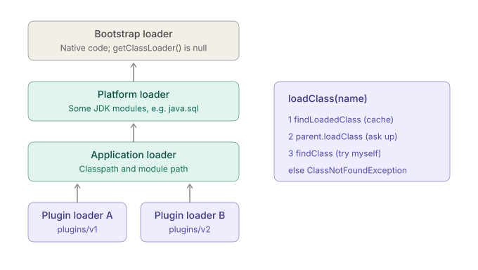

# Class loader 
## As loader hierarchy 


| Loader | Accessor | Loads | Notes |
|---|---|---|---|
| Bootstrap | `getClassLoader()` returns `null` | `java.base` and core JDK modules | Native code, not a Java object |
| Platform | `ClassLoader.getPlatformClassLoader()` | Some JDK modules (e.g. `java.sql`) | Replaces the old extension loader |
| Application (system) | `ClassLoader.getSystemClassLoader()` | Your classpath and module path | Parent is the platform loader |


<---------- ADD NOTES LATER : extract from below ---------->
    


Arrows point from child to parent, which is the direction of delegation.

| Loader | Accessor | Loads | Notes |
|---|---|---|---|
| Bootstrap | `getClassLoader()` returns `null` | `java.base` and core JDK modules | Native code, not a Java object |
| Platform | `ClassLoader.getPlatformClassLoader()` | Some JDK modules (e.g. `java.sql`) | Replaces the old extension loader |
| Application (system) | `ClassLoader.getSystemClassLoader()` | Your classpath and module path | Parent is the platform loader |

```java
String.class.getClassLoader();               // null  (bootstrap)
java.sql.Connection.class.getClassLoader();  // PlatformClassLoader
Client.class.getClassLoader();               // AppClassLoader
```

**Pre-Java 9 versus Java 9+:**
- Java 8 had bootstrap (`rt.jar`), an **extension** loader (`jre/lib/ext`, `-Djava.ext.dirs`) and the application loader.
- Java 9 removed `rt.jar` and the ext mechanism. The platform loader took the extension loader's place in the hierarchy.
- The application loader is **no longer a `URLClassLoader`**. Code like `(URLClassLoader) ClassLoader.getSystemClassLoader()` throws `ClassCastException` on 9+. This is a classic migration break.
- The built-in loaders are module-aware. They keep a package-to-loader map and can jump straight to the defining loader.

## 3. The delegation model

The classic `loadClass` logic (Java 8 shape, which is still the right mental model):

```java
protected Class<?> loadClass(String name, boolean resolve) throws ClassNotFoundException {
    synchronized (getClassLoadingLock(name)) {
        Class<?> c = findLoadedClass(name);                  // 1. already defined by me?
        if (c == null) {
            try {
                c = (parent != null) ? parent.loadClass(name, false)
                                     : findBootstrapClassOrNull(name);   // 2. ask upward first
            } catch (ClassNotFoundException ignored) { }
            if (c == null) c = findClass(name);              // 3. only now try myself
        }
        if (resolve) resolveClass(c);
        return c;
    }
}
```

**Why parent-first:**
- **Security:** your code can't shadow `java.lang.String` with a malicious copy. `defineClass` also refuses names starting with `java.` (`SecurityException: Prohibited package name`).
- **Consistency:** every loader that delegates sees the same `Object`, `String` and `List`, so types agree across components.
- **No duplicates:** shared classes are loaded once.

**Visibility rule:** a child sees its parents' classes. A parent never sees its children's classes.

**Who deliberately breaks parent-first:**
- Servlet containers load webapp classes **child-first**, so each webapp can carry its own library versions.
- OSGi uses a per-bundle wiring graph instead of a tree.
- JPMS routes by module.

## 4. Runtime identity of a class

A class's runtime identity is **(fully-qualified name, defining loader)**, not the name alone. The same `.class` bytes loaded by two unrelated loaders produce two distinct, incompatible classes:

```text
java.lang.ClassCastException: class com.ig.FeeRule cannot be cast to class com.ig.FeeRule
 (com.ig.FeeRule is in unnamed module of loader PluginClassLoader @1b2c;
  com.ig.FeeRule is in unnamed module of loader 'app')
```

"X cannot be cast to X" always means two loaders. The defining loader is the one that called `defineClass`. An initiating loader is any loader that was asked and returned the class (usually by delegation).

## 5. Custom class loaders

Rule: **override `findClass`, not `loadClass`**. That keeps delegation intact.

```java
final class PluginClassLoader extends ClassLoader {
    private final Path root;

    PluginClassLoader(Path root, ClassLoader parent) {
        super(parent);
        this.root = root;
    }

    @Override
    protected Class<?> findClass(String name) throws ClassNotFoundException {
        Path file = root.resolve(name.replace('.', '/') + ".class");
        try {
            byte[] bytes = Files.readAllBytes(file);
            return defineClass(name, bytes, 0, bytes.length);
        } catch (IOException e) {
            throw new ClassNotFoundException(name, e);
        }
    }
}

// usage: the shared contract (FeeRule) comes from the parent, so casts work
ClassLoader parent = FeeRule.class.getClassLoader();
PluginClassLoader loader = new PluginClassLoader(Path.of("plugins/v1"), parent);
Class<?> c = loader.loadClass("com.ig.plugins.PercentageFeeRule");
FeeRule rule = (FeeRule) c.getDeclaredConstructor().newInstance();
```

The interface (`FeeRule`) must be visible through the **parent**, so both sides agree on one `Class`. The implementation comes from the plugin loader. If the plugin directory also contained its own copy of `FeeRule`, delegation would pick the parent's copy anyway.

**Use cases:**
- Plugin systems.
- App servers (per-webapp isolation).
- Hot reload (a new loader instance loads the new bytes, and the old loader is dropped).
- Loading from a database, network or encrypted store.
- Runtime-generated classes.
- Version isolation (loader A and loader B hold different versions of the same library).

`URLClassLoader` (still present in 21, `Closeable` since 7) covers the plain "load from these JARs" case. Subclasses that load concurrently should call `registerAsParallelCapable()`.

## 6. `Class.forName` vs `ClassLoader.loadClass`

| | `Class.forName(name)` | `Class.forName(name, false, loader)` | `loader.loadClass(name)` |
|---|---|---|---|
| Loader used | Caller's defining loader | The one you pass | That loader |
| Initializes? | **Yes** | No | **No** |
| Array names like `"[Ljava.lang.String;"` | Works | Works | Fails |

`Class.forName("oracle.jdbc.OracleDriver")` was the old JDBC idiom because **initializing the class ran a static block that registered the driver**. Since JDBC 4 (Java 6), drivers are discovered through `ServiceLoader`, so the call is no longer needed.

## 7. The context class loader (TCCL)

Each thread carries `Thread.getContextClassLoader()`, which is an escape hatch from the strict parent-only visibility.

**The problem it solves.** Framework code loaded by a **parent** loader (JNDI, JAXP, JDBC `DriverManager`, `ServiceLoader.load(Class)`) must sometimes load classes that live in a **child** loader (your app's). A parent can't see downward, so it asks the thread's context loader.

- A new thread **inherits** the creator's TCCL. The default is the application loader.
- App servers set it per request to the webapp's loader.
- **Trap:** pool threads created during one webapp's lifetime keep that loader reference after undeploy, which pins the whole loader (see §10).
- **Trap:** code that sets the TCCL temporarily must restore it in `finally`.

## 8. When does initialization happen?

A class is initialized on its **first active use**:

| Triggers initialization | Does **not** trigger it |
|---|---|
| `new X()` | `X.class` literal |
| Calling a static method | Reading a **constant variable** (see below) |
| Reading/writing a static field that is **not** a constant variable | `new X[10]` (array creation) |
| `Class.forName(name)` (the one-argument form) | `instanceof`, casts, declaring a variable of type `X` |
| Reflective `newInstance`, static `Method.invoke`, `Field.get/set` | `loader.loadClass(name)` |
| Initializing a **subclass** (superclass first) | Accessing an inherited static field through the subclass: only the **declaring** class initializes |
| The main class at JVM start | |

**Interface rules:**
- Initializing a class does **not** initialize its superinterfaces, **unless** an interface declares a `default` method.
- An interface is initialized when one of its static methods is called or one of its non-constant static fields is accessed.

**Constant inlining.** A *constant variable* is a `final` field of primitive or `String` type, initialized by a **compile-time constant expression**. `javac` copies the value into the using class, so the declaring class is never touched:

```java
class MarketConfig {
    static final int     MAX_ORDERS = 500;      // constant variable: inlined
    static final Integer MAX_BOXED  = 500;      // NOT a constant: needs the field
    static { System.out.println("MarketConfig init"); }
}

int a = MarketConfig.MAX_ORDERS;   // prints nothing, class not initialized
Integer b = MarketConfig.MAX_BOXED; // prints "MarketConfig init"
```

A second consequence is a **binary-compatibility trap**: change `MAX_ORDERS` to `800` and recompile only `MarketConfig`, and callers keep using the old `500` until they are recompiled.

## 9. Order of execution

**Class initialization** (`<clinit>`, runs once):
- Static field initializers and `static {}` blocks run in **textual order**.
- The superclass is initialized first.
- The JVM runs `<clinit>` under a per-class lock. Other threads that need the class **block** until it finishes, which is why the lazy-holder singleton is thread-safe.
- The same thread re-entering sees the class **partially initialized**.
- Cyclic initialization across two threads can deadlock.

**Object creation:** allocate memory with all fields at defaults, then call the constructor. The constructor runs `super(...)` first, then the instance initializers and field initializers in textual order, then the rest of the constructor body.

```java
class FeeRule {
    static { System.out.println("1 FeeRule static"); }
    { System.out.println("3 FeeRule instance init"); }
    FeeRule() { System.out.println("4 FeeRule ctor"); describe(); }
    void describe() { }
}
class FlatFeeRule extends FeeRule {
    static { System.out.println("2 FlatFeeRule static"); }
    private int fee = 25;
    { System.out.println("5 FlatFeeRule instance init"); }
    FlatFeeRule() { super(); System.out.println("6 FlatFeeRule ctor"); }
    @Override void describe() { System.out.println("describe fee=" + fee); }
}
new FlatFeeRule();
```

Output, in order:
```text
1 FeeRule static
2 FlatFeeRule static
3 FeeRule instance init
4 FeeRule ctor
describe fee=0          <- subclass field not yet initialized
5 FlatFeeRule instance init
6 FlatFeeRule ctor
```
`describe()` ran while `fee` was still `0`. An overridable method called from a constructor sees a half-built subclass.

**Static ordering trap (singleton):**
```java
class Registry {
    static final Registry INSTANCE = new Registry();  // constructor runs first, created becomes 1
    static int created = 0;                           // then this resets it to 0
    Registry() { created++; }
}
Registry.created;   // 0, not 1
```
Textual order is execution order. Without the `= 0` initializer, the value would stay `1`.

## 10. Errors, and the two that get confused

| | `ClassNotFoundException` | `NoClassDefFoundError` |
|---|---|---|
| Kind | Checked `Exception` | `Error` (a `LinkageError`) |
| Cause | An **explicit by-name** load failed (`Class.forName`, `loadClass`, `findClass`) | The class existed at compile time, but the JVM can't find it at runtime, **or** its earlier initialization failed |
| Typical fix | Fix the name, classpath or loader | Missing/mismatched dependency JAR at runtime |

**Initialization failure chain:**
1. First use: `ExceptionInInitializerError` (it wraps an unchecked exception thrown from a static initializer).
2. Every later use in that JVM: `NoClassDefFoundError: Could not initialize class X`. The class is permanently marked erroneous.

When you see the second error, the **real cause is in the first one**, which often scrolled out of the logs at startup. Recent JDKs chain the original failure as the cause. Older ones don't.

Related linkage errors usually mean a **version mismatch between compile time and runtime** (two versions of a library on the classpath):
- `NoSuchMethodError`
- `NoSuchFieldError`
- `AbstractMethodError`
- `IncompatibleClassChangeError`
- `LinkageError: loader constraint violation`

**Linking details worth knowing:**
- Preparation zeroes statics. The real values arrive in `<clinit>`. `static int x = 5;` is `0` between preparation and initialization.
- The verifier uses the `StackMapTable` type-checking algorithm. Disabling verification flags are deprecated, so don't rely on them.
- Because resolution is lazy, a missing method often fails at the first **call**, not at class load.

## 11. Class unloading and leaks

A class is unloaded only when its **defining loader becomes unreachable**. That means no live instance of any of its classes, no reference to any of its `Class` objects, and no reference to the loader itself. The unit of unloading is the **loader**, never a single class. Bootstrap, platform and application classes are effectively never unloaded.

**Classic leak routes after a redeploy** (the old webapp loader stays reachable):
- A static field in a parent-loader class holding an instance of a child class.
- A `ThreadLocal` value left on a pooled thread.
- A pool thread still carrying the old TCCL.
- A JDBC driver still registered in `DriverManager`.
- A shutdown hook or non-daemon thread started by the app.
- A cache or `MBean` registration that is never removed.

Result: `OutOfMemoryError: Metaspace` after N redeploys.

## 12. Detailed memory areas

Four ideas make sense of the box diagram below:
- **Per-thread allocation:** inside Eden, every thread gets a private **TLAB** (thread-local allocation buffer). Allocation is a pointer bump with no lock. A full TLAB is replaced with a new one.
- **Generations:** new objects start in Eden. Survivors are copied between S0 and S1 and gain an **age**. Past a threshold (`-XX:MaxTenuringThreshold`, max 15) they are promoted to the old generation.
- **G1** (the default) uses many equal-sized **regions** rather than fixed contiguous spaces. Objects of at least half a region are **humongous** and allocated outside the TLAB path.
- **Metaspace** holds class metadata in **per-loader arenas**. Dropping a loader frees its whole arena at once.

The native area is the part people forget. A container is killed by the OS when the **whole process** exceeds its limit, even if the heap never reached `-Xmx`.

| Area | Holds | Key flags and notes |
|---|---|---|
| Heap | Objects, arrays, `Class` mirrors (with static field slots), interned strings | `-Xms`, `-Xmx`, `-XX:MaxRAMPercentage`. If no max is set, the JVM defaults to 1/4 of available RAM |
| Metaspace | Class metadata: method bytecode, constant pools, vtables | Native memory, unbounded unless `-XX:MaxMetaspaceSize`. `-XX:MetaspaceSize` is the GC trigger threshold, not a cap |
| Compressed class space | Class structures when compressed class pointers are on | `-XX:CompressedClassSpaceSize` (default 1 GB). It is a separate region and has its own OOM message |
| Code cache | JIT-compiled machine code | Segmented since Java 9. `-XX:ReservedCodeCacheSize` |
| Thread stacks | Frames of each platform thread | `-Xss`, typically 1 MB per thread on 64-bit Linux. Cost scales with thread count |
| Direct memory | `ByteBuffer.allocateDirect`, NIO, Netty | `-XX:MaxDirectMemorySize` (defaults to roughly the max heap size) |
| GC and internals | Remembered sets, card tables, symbol tables | Grows with heap size and GC choice |

- **Container sizing:** a rough rule is `RSS ≈ heap + Metaspace + code cache + (threads × stack) + direct + GC overhead`. This is why a Fargate task with a 2 GB limit and `-Xmx2g` gets OOM-killed. Use `-XX:MaxRAMPercentage` (e.g. 70–75) instead of hard-coding `-Xmx`.
- **Native memory tracking:** `-XX:NativeMemoryTracking=summary`, then `jcmd <pid> VM.native_memory summary`, shows the native breakdown.
- **ZGC in 21:** generational mode is opt-in (`-XX:+UseZGC -XX:+ZGenerational`). It became the default mode in Java 23, and the non-generational mode was removed in Java 24.

**Where each class artifact lives:**

| Thing | Location |
|---|---|
| Class metadata (methods, constant pool) | Metaspace |
| `Class` object, including the static field slots (HotSpot, Java 7+) | Heap |
| Instances | Heap |
| Compiled code | Code cache |

## 13. JPMS and class loaders (awareness level)

- Every named module is defined to **exactly one loader**. Each loader also has one **unnamed module** for classpath classes.
- The built-in loaders map packages to modules, so a split package (the same package in two modules visible to one loader) is rejected.
- A `ModuleLayer` is a set of resolved modules mapped to loaders. The boot layer is created at startup. Frameworks that need isolation (plugin hosts) can build **child layers**, each with its own loaders. This is the module-system replacement for hand-rolled plugin loaders.
- `Module.isOpen(pkg, caller)` and `opens` decide reflective access, regardless of which loader loaded the class.

## 14. Diagnostics

```bash
java -Xlog:class+load:file=classload.log -jar app.jar     # every class, with its source
java -Xlog:class+init=info ...                            # initialization events
java -Xlog:class+unload=info ...                          # unloading (leak hunting)
java -verbose:class ...                                   # older alias for class loading output
```

Each class+load line shows a `source:` (a JAR path, `jrt:/java.base`, or `shared objects file` for CDS). That is the fastest way to see **which JAR a class actually came from**.

In code:
```java
Client.class.getProtectionDomain().getCodeSource();   // JAR location (null for bootstrap classes)
Client.class.getResource("Client.class");             // also reveals the origin
```

For metaspace leaks, take a heap dump and look for many instances of the same loader class (`jcmd <pid> GC.class_stats` and `jmap -clstats` give per-loader class counts and sizes).

## Trap summary

1. A class's identity is **(name, defining loader)**. "X cannot be cast to X" means two loaders.
2. Override **`findClass`**, not `loadClass`, to keep parent-first delegation. A parent can never see a child's classes.
3. From Java 9, the application loader is **not a `URLClassLoader`**, and `rt.jar` and the ext mechanism are gone.
4. `Class.forName(name)` **initializes**. `loadClass` and the three-argument `forName(..., false, ...)` don't. `X.class` doesn't either.
5. Constant variables (`static final` primitive/`String` with a compile-time constant value) are **inlined**. Reading them doesn't initialize the class, and changing them needs a recompile of callers.
6. Accessing an inherited static through a subclass initializes only the **declaring** class. Array creation never initializes the element class.
7. Initializing a class doesn't initialize its superinterfaces, unless they declare **default methods**.
8. Static initializers run in **textual order**, so a later `static int created = 0;` can overwrite a constructor side effect.
9. A constructor that calls an overridable method sees **default values** in subclass fields.
10. `ClassNotFoundException` (checked, by-name lookup) is not `NoClassDefFoundError` (error, runtime absence or failed init).
11. After one `ExceptionInInitializerError`, every later use gives `NoClassDefFoundError: Could not initialize class`. **Look for the first failure.**
12. Resolution is lazy, so `NoSuchMethodError` surfaces at first call, not at startup.
13. Classes unload only with their **whole loader**. Pooled threads, `ThreadLocal`s, drivers and the TCCL are the usual leak anchors.
14. TCCL is inherited by new threads, so set it carefully and restore it in `finally`.
15. Metaspace is native and unbounded by default. In containers, **total RSS** matters, not just heap.
16. `Metaspace`, `Compressed class space` and `Direct buffer memory` all have separate OOM messages.

Likely expansions if you want them:
- A runnable hot-reload demo that swaps `PercentageFeeRule` v1 for v2 without a restart.
- A worked leak hunt with `-Xlog:class+unload` and a heap dump.
- How `ServiceLoader` uses the TCCL and `provides`/`uses`.
- A JVM-flag cheat sheet for sizing containers.
- GC algorithms in more depth.

Whenever you're ready, the next module is **G12: Records & Sealed Types**.

