## The entity state machine


### The entity states 
**Transient (new)** — You just did `Account account = new Account();` and set its fields. That's it — it's a plain Java object. Hibernate has never heard of it. It's not in the persistence context, it has no identity map entry, no EntityEntry, nothing. And obviously no row exists in the DB for it.

**Managed (persistent)** — The entity is sitting inside the StatefulPersistenceContext. Hibernate created an EntityEntry for it (status MANAGED), added it to the identity map keyed by its id, and it's now subject to dirty checking at flush time. Any field you change on this object gets picked up automatically; you never call an explicit "update."

Whether a DB row exists yet depends on how it got here:
- If it came from find()/load(), the row already existed — that's how Hibernate populated the object.
- If it came from persist() on a fresh transient object, the row may or may not exist yet depending on the id generation strategy. With IDENTITY, Hibernate has to insert immediately to get the generated key back, so the row appears right away. With SEQUENCE or TABLE, Hibernate can get the id from the sequence without touching the row, so the insert is queued in the ActionQueue as an EntityInsertAction and only actually hits the DB at flush time.

**Detached** — The entity used to be managed, but the persistence context that knew about it is gone — EntityManager.close(), clear(), evict(), or the transaction/session simply ending. Hibernate throws away the EntityEntry for it. No more dirty checking, no more identity map entry.

The DB row exists — but only reflecting whatever was last flushed. If you change a field on a detached Client object, that change lives only in Java memory. It will never reach the database on its own, because nothing is watching this object anymore.

**Removed** — You called remove() on a managed entity. The EntityEntry status flips to DELETED, and Hibernate queues an EntityDeleteAction. Important detail: the entity is still inside the persistence context at this point — it hasn't vanished, it's just marked for death. The DB row still exists until flush actually runs the DELETE statement. After flush/commit, the row is gone from the DB and the entity is dropped from the persistence context entirely — there's no state after that; the object is just an orphaned Java instance now.


### The state transitions 
**Transient**
```java
Client client = new Client();
client.name = "Rajat Kapoor";
client.email = "rajat@example.com";
client.phone = "+91-98765-43210";
```

**persist() — Transient → Managed**
- You call entityManager.persist(account). Hibernate assigns it an EntityEntry, puts it in the identity map, and schedules the insert, status changes to `MANAGED`. 
- This is a one-way door for a truly new object — there's no arrow back from Managed to Transient. 
- Cascade matters here too: if Client has cascade = PERSIST on its accounts list, persisting the Client drags every attached transient Account into Managed as well. 
- It also queues an EntityInsertAction in the ActionQueue

```java
entityManager.persist(client);
```

Now add an account with cascade:
```java
Account acc = new Account();
acc.type = AccountType.IGCFD;
acc.status = AccountStatus.ACTIVE;
acc.client = client;
client.accounts.add(acc);
```

Notice — no `entityManager.persist(acc)` needed. Because `Client.accounts` has `cascade = CascadeType.ALL`, the moment client was persisted, it cascades persist onto `acc` automatically. `acc` gets its own `EntityEntry` and its own queued insert, without you calling persist on it directly.

**find() / load() — (external) → Managed**
This doesn't come from a transient object at all — it's a fresh read from the DB. Hibernate builds the entity, creates its EntityEntry, and hands you back a managed reference straight away.

```java
Client loaded = entityManager.find(Client.class, client.id);
```

**detach() / clear() / evict() / session close — Managed → Detached**
The persistence context drops its tracking of the entity. The Java object itself is untouched — same field values, same identity — but Hibernate stops watching it. This is the classic trap: people modify a detached entity, expect it to "just save," and nothing happens because there's no dirty checking anymore.

```java
entityManager.detach(loaded);
// or entityManager.clear(); or entityManager.close(); or transaction commit with a non-extended EM
```

**merge() — Detached → Managed**
```java
loaded.phone = "+91-77777-88888"; 
Client managedClient = entityManager.merge(loaded);
```

- Hibernate looks in the current persistence context's identity map for an entity with loaded's id.
- If it's not there, Hibernate issues a SELECT to load it fresh, and that becomes managed.
- Hibernate copies loaded's field values (including your unsaved phone change) onto this managed instance. 
- managedClient — the return value — is that managed instance.
- Your original detached Client reference stays detached, it's just been used as a data source. merge() does not make your detached object managed

**remove() — Managed → Removed**
Marks the entity for deletion. It stays in the persistence context (still trackable, still has an EntityEntry) but any further field changes on it are pointless — it's going away regardless. The DB row is untouched until flush.
```java
entityManager.remove(managedClient);
```
**flush two scenarios**
```java
entityManager.flush(); // or the transaction commits
```

**flush / commit — Removed → gone**
The queued EntityDeleteAction runs, the DELETE statement executes, the row disappears from the DB, and the entity is purged from the persistence context. There's no "post-removed" state — the Java object just becomes a dangling reference to something the database no longer knows about.

**flush() - still Managed, but now the row is real**
- Persistence context: unchanged — client and acc are still MANAGED. 
- Flush doesn't remove anything from the persistence context; it just drains the ActionQueue by running the actual SQL. 
- DB row: now exists for both client and acc (if it didn't already, under SEQUENCE). This is the moment dirty checking's cousin, the insert queue, actually talks to the database.

### In terms of persistence context 
- The persistence context is really just: "which entities am I responsible for dirty-checking and flushing right now?" 
- Transient and Detached are both outside that responsibility (one never was in it, the other used to be and isn't anymore) — that's why plain field mutations on either do nothing to the DB. 
- Managed and Removed are both inside it — Hibernate is actively tracking them, which is why their eventual DB effect (insert or delete) happens automatically at flush without you writing a single SQL statement.

---
## Miscellaneous 
## The state × operation matrix

| | `persist` | `merge` | `remove` | `refresh` | `detach` | flush effect |
|---|---|---|---|---|---|---|
| **transient** | → managed, INSERT queued | → a managed **copy** + INSERT; your arg stays transient | `IllegalArgumentException` | `IllegalArgumentException` | no-op | — |
| **managed** | no-op | returns the same instance unchanged | → removed | re-reads, discards your changes | → detached, changes lost | UPDATE if dirty |
| **detached** | `EntityExistsException` (or at flush) | → returns the managed instance with your state copied | `IllegalArgumentException` | throws in Hibernate 7 `[V]` | no-op | — |
| **removed** | **un-removes it** | undefined | no-op | — | → detached, delete cancelled | DELETE |

---

## The signature bugs of each state

| Mistake | Symptom |
|---|---|
| Mutating a **detached** entity | "my update silently did nothing" — no exception anywhere |
| Mutating a **managed** entity you only meant to read | an UPDATE and a version bump you never wrote |
| Mutating a **projection** | nothing happens, silently — projections are never managed |
| Holding a managed entity beyond its transaction (a field, a static map, an HTTP session, a `@Cacheable` cache) | a detached instance that lazily explodes, **plus a memory leak** because it holds its whole loaded graph |
| Serialising an entity to JSON | proxies, a `hibernateLazyInitializer` field, bidirectional cycles → `StackOverflowError` |
| Sending an entity to another thread | a data race — managed entities are not thread-safe |
| Sending an entity over a message queue | the above, plus schema coupling between services |

The rule that removes all of these at once:

> **Entities do not leave the transactional service layer.** Everything crossing out is a
> DTO/record.

---

## Read-only mode
Read-only is a mode you can put an entity into where Hibernate still tracks it in the persistence context, but deliberately skips dirty checking and skips generating an UPDATE for it at flush — even if you mutate its fields.

### Why it exists

Normally, every managed entity costs Hibernate a dirty-check comparison against its loaded snapshot at every flush. For a `Client` you're just displaying on a "view profile" screen, that's wasted work — you never intend to save it. Read-only entities skip that cost entirely — and it goes deeper than just skipping the *comparison*: Hibernate never even takes the snapshot in the first place. Normally, right after hydrating an entity's fields, Hibernate does a `deepCopy()` of the row's values and stores that as `EntityEntry.loadedState` — the baseline it'll diff against later. For a read-only entity, that deep copy is skipped outright, because there will never be a dirty check to diff against. So it's lighter on both CPU (no comparison at flush) and memory (no snapshot array kept around) — which matters more the bigger and more numerous your entities' fields are.

### How to mark it

**Per query:**
```java
List<Client> clients = entityManager.createQuery("SELECT c FROM Client c", Client.class)
        .setHint("org.hibernate.readOnly", true)
        .getResultList();
```

**Per entity, using the Hibernate `Session` API:**
```java
Session session = entityManager.unwrap(Session.class);
Client client = session.find(Client.class, 1L);
session.setReadOnly(client, true);
```

**Whole session, as a default:**
```java
session.setDefaultReadOnly(true);
```

**Whole entity type, always, via mapping:**
```java
@Entity
@Immutable
class ExchangeRateTable {
    @Id Long id;
    String currencyPair;
    BigDecimal rate;
}
```
`@Immutable` is the strongest option — that entity type is read-only everywhere, always, no per-query opt-in needed. Good fit for things like reference/lookup tables that never change through your app (currency pairs, account-type enums backed by a table, country codes).

### What actually happens

```java
Client client = entityManager.find(Client.class, 1L);
session.setReadOnly(client, true);

client.phone = "+91-11111-22222"; // mutate it anyway

entityManager.flush();
// No UPDATE runs. The DB row is untouched.
```

- **Persistence context:** `client` is still tracked — still in the identity map, still has an `EntityEntry` — but its `EntityEntry.status` is `Status.READ_ONLY`, a distinct value from `Status.MANAGED` (they're siblings in the same enum, alongside `DELETED`, `GONE`, `LOADING`, `SAVING`). It has *not* become Detached; it hasn't left the persistence context, it's just wearing a different status tag that tells the flush routine to skip it entirely. And because of that status, `loadedState` was never populated for it — there's no snapshot sitting in memory to compare against, unlike a normal managed entity.
- **DB row:** untouched, regardless of what you set on the object in Java. The flush loop sees `Status.READ_ONLY`, doesn't even attempt a dirty comparison, and no `EntityUpdateAction` ever gets queued.
- Lazy associations still load normally — read-only only affects whether *this* entity's own state gets flushed, not whether you can navigate its relationships.

### Toggling it back

```java
session.setReadOnly(client, false); // now dirty checking resumes for it
```
This is where the missing snapshot actually matters, not just as trivia: since `loadedState` was never captured while it was read-only, Hibernate doesn't have an old baseline to diff against the moment you flip it back. The next flush's dirty check works off whatever state gets established from that point forward — it isn't retroactively reconstructing "what the row looked like when it was originally loaded." So if you mutated fields while read-only and then flip it to writable, don't assume Hibernate "remembers" the pre-read-only values for comparison; it doesn't have them.

### Where it's actually useful in your world

- A `GET /accounts/{id}` endpoint that just serializes an `Account` to JSON — no reason to pay dirty-check cost, or hold a snapshot array, for something you're about to discard after the request.
- Reporting/batch reads over thousands of `Client` rows for an export — turning on `setDefaultReadOnly(true)` for that whole session avoids Hibernate keeping full snapshot copies for every one of them, which matters a lot at scale.
- Static-ish reference data like `AccountType`/`AccountStatus` lookup tables, if they're entities at all rather than plain enums — `@Immutable` fits well there.

The mental model, corrected: read-only isn't a flag bolted onto `MANAGED` — it's its own status. What it changes is whether the persistence context bothers to (a) keep a snapshot of this entity's state at all, and (b) reconcile that state with the database at flush. A read-only entity is still fully present and trackable in the persistence context; it's just been told upfront "don't bother remembering or comparing — nothing here is ever getting saved."

---


### The rest of the `save` / delete family

| Method | Semantics |
|---|---|
| `save(e)` | persist or merge, per `isNew` |
| `saveAll(iterable)` | **a loop over `save`** — not a batch. Does not enable JDBC batching by itself, and holds every entity in the context |
| `saveAndFlush(e)` | `save` then `flush` — moves the exception to a line you chose |
| `saveAllAndFlush(iterable)` | the same for a collection |
| `flush()` | pushes pending SQL out now |

| Delete method | What it does |
|---|---|
| `delete(entity)` | `remove` on a managed entity (merges first if detached) |
| `deleteById(id)` | `findById` then `remove` — so a SELECT, then a DELETE |
| `deleteAllById(ids)` | a loop of the above |
| `deleteAll()` | **loads every entity** and removes them one at a time, so callbacks, cascades and orphan removal fire |
| `deleteAll(entities)` | a loop of `delete` |
| `deleteAllInBatch()` | a **single** `delete from player` — skips callbacks, cascades, orphan removal, and leaves L1/L2 stale |
| `deleteAllByIdInBatch(ids)` | a single `delete ... where id in (?,?)` |
| `deleteInBatch(entities)` | a single statement for those entities |

> `[TRAP]` `deleteAll()` vs `deleteAllInBatch()` differ enormously. The first is N+1 statements
> with full semantics; the second is one statement with none. **Know which you called.**

`[V]` `deleteById` on a missing id silently returns in Spring Data 2.x+; older versions threw
`EmptyResultDataAccessException`.

