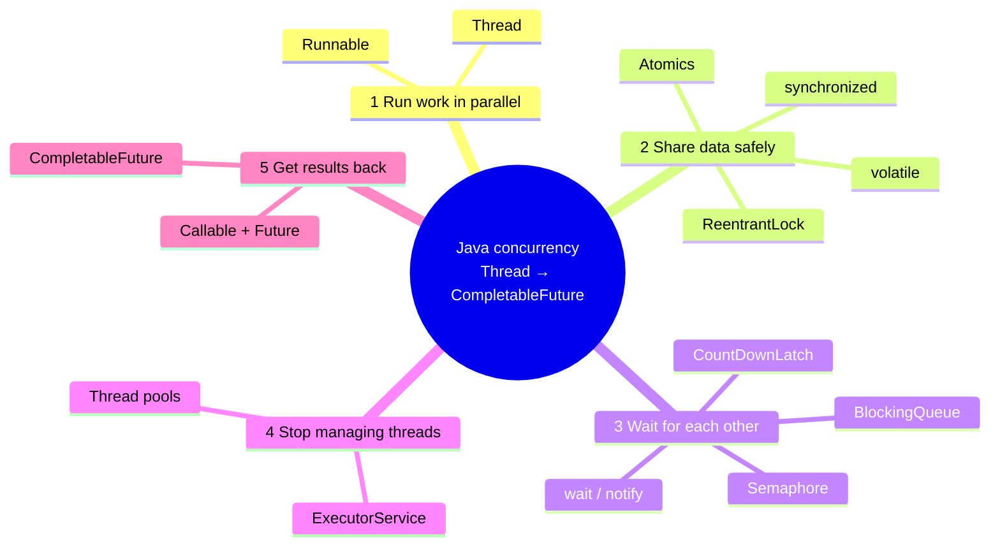
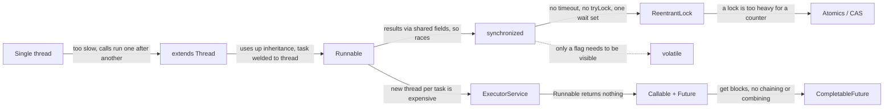

# Roadmap: From `Thread` to `CompletableFuture`
One running example, ten steps. At each step: **why it was needed → how it looks → what still hurt → why we moved on.**
Detailed notes for each step are linked at the end of every section.

## The mind-map


## The evolution chain
Each arrow is labelled with the drawback that forced the next step.


---

## The running example
A payment request needs three remote calls, each taking about 300 ms:
1. `accountService.load(id)` gets the account.
2. `fraudService.score(id)` gets a fraud score from 0 to 100.
3. `cardGateway.charge(account, amount)` charges the card. **This needs 1 and 2 first.**

1 and 2 are independent, so they can run in parallel. 3 depends on both.
**Best possible time: ~600 ms** (300 ms for 1 and 2 together, then 300 ms for 3).

---

## Step 0 — Single thread
```java
Account acc  = accountService.load(id);       // 300 ms
int score    = fraudService.score(id);        // 300 ms (just waits, CPU idle)
Receipt r    = cardGateway.charge(acc, amt);  // 300 ms
// total ≈ 900 ms
```
| ✅ Good | ❌ Drawback |
|---|---|
| Simple, easy to debug | Independent calls wait for each other. The CPU sits idle during I/O. |

➡️ **Moved on because:** calls 1 and 2 don't need each other. We want them to run **at the same time**.

---

## Step 1 — `extends Thread`
**Why:** this was the first tool Java gave us for running code in parallel.
```java
class FraudCheckThread extends Thread {
    int score;                               // result has to be stashed in a field
    public void run() { score = fraudService.score(id); }
}

FraudCheckThread t = new FraudCheckThread();
t.start();                                   // runs in parallel
Account acc = accountService.load(id);       // main thread works meanwhile
t.join();                                    // wait for it to finish
Receipt r = cardGateway.charge(acc, amt, t.score);   // ≈ 600 ms
```
| ❌ Drawback | Why it hurts |
|---|---|
| Uses up `extends` | The class can't extend anything else. |
| Task and thread are welded together | You can't hand the same task to a pool or reuse it. |
| `run()` returns `void` | The result is smuggled out through a field. |
| An exception kills the thread silently | The caller never finds out. |

➡️ **Moved on because:** *what* to run (the task) should be separate from *who* runs it (the thread).
📖 [01-multithreading-basics](01-multithreading-basics.md)

---

## Step 2 — `Runnable`
**Why:** separate the task from the thread. Any thread, or later any pool, can run a `Runnable`.
```java
class PaymentResult { volatile int score; }
PaymentResult res = new PaymentResult();

Runnable fraudCheck = () -> res.score = fraudService.score(id);
Thread t = new Thread(fraudCheck);
t.start();
t.join();
```
| ✅ Fixed | ❌ Still hurts |
|---|---|
| No inheritance needed, works with lambdas | `run()` still returns `void` and can't throw checked exceptions |
| The task is reusable | The result goes through **shared mutable state**, which invites race conditions |
| | `new Thread()` per task costs ~1 MB of stack plus an OS call. At 10k requests/sec the JVM dies. |

➡️ **Moved on because of two separate problems:**
- Shared state is now unsafe → **Steps 3–6** (making shared data safe).
- Creating threads is expensive and there's no result → **Steps 7–9** (pools, `Future`, `CompletableFuture`).

📖 [01-multithreading-basics](01-multithreading-basics.md), [02-methods](02-methods.md)

---

## Step 3 — `synchronized`
**Why:** once threads share data, `count++` loses updates. It's three steps (read, add, write), and another thread can slip in between them.
```java
class PaymentStats {
    private long processed = 0;

    // BROKEN: two threads read 41, both write 42, one payment is lost
    void recordUnsafe() { processed++; }

    // FIXED: only one thread at a time inside
    synchronized void record() { processed++; }
}
```
**Coordination with `wait`/`notify`** (from the same era) lets one thread wait for another's result:
```java
synchronized (lock) {
    while (res.score == -1) lock.wait();   // releases lock, sleeps
}
// producer side:
synchronized (lock) { res.score = s; lock.notifyAll(); }
```
| ✅ Fixed | ❌ Still hurts |
|---|---|
| Atomicity + visibility + ordering for the block | A blocked thread waits **forever**: no timeout, no `tryLock` |
| Built into the language, auto-released | A thread waiting for the lock can't be **interrupted** |
| | One wait set per object, so `notify()` can wake the wrong thread and deadlock |
| | `wait`/`notify` is easy to get wrong (`if` instead of `while`, lost signals) |
| | Overkill when you only need a stop flag to be visible |

➡️ **Moved on because:** we need (a) something lighter for simple flags and (b) something more controllable for real locking.
📖 [03-challenges](03-challenges.md), [04-synchronization-and-locks](04-synchronization-and-locks.md), [06-coordination](06-coordination.md)

---

## Step 4 — `volatile` (side branch: visibility only)
**Why:** a shutdown flag doesn't need mutual exclusion. It only needs other threads to **see** the write.
```java
class Sweeper implements Runnable {
    private volatile boolean running = true;   // without volatile, the JIT may cache it so the loop never stops
    public void run() { while (running) expireStaleOrders(); }
    public void stop() { running = false; }
}
```
| ✅ Fixed | ❌ Still hurts |
|---|---|
| Cheap visibility and ordering, no locking | **No atomicity**: `volatile long count; count++` still loses updates |

➡️ Use it for flags and published references. For compound updates, go to Step 5 or Step 6.
📖 [03-challenges](03-challenges.md#volatile)

---

## Step 5 — `ReentrantLock` + `Condition`
**Why:** fixes `synchronized`'s lack of control.
```java
private final ReentrantLock lock = new ReentrantLock();

boolean debit(long amt) throws InterruptedException {
    if (!lock.tryLock(200, TimeUnit.MILLISECONDS)) {   // give up instead of hanging
        return false;                                  // e.g. return "busy, retry"
    }
    try {
        if (balance < amt) return false;
        balance -= amt;
        return true;
    } finally {
        lock.unlock();                                 // MUST be in finally
    }
}
```
| `synchronized` | `ReentrantLock` |
|---|---|
| waits forever | `tryLock(timeout)` |
| not interruptible | `lockInterruptibly()` |
| one wait set | many `Condition`s (`notFull`, `notEmpty`) |
| no fairness option | `new ReentrantLock(true)` |

| ❌ Still hurts |
|---|
| Forgetting `unlock()` in `finally` means the lock is held forever |
| Still **blocking**: threads park and context-switch |
| Too heavy for "just increment a counter" |

➡️ **Moved on because:** for a single variable, the CPU can do the update atomically **without any lock**.
📖 [04-synchronization-and-locks](04-synchronization-and-locks.md)

---

## Step 6 — Atomics (CAS)
**Why:** lock-free, non-blocking updates for one variable.
```java
private final AtomicLong processed = new AtomicLong();
void record() { processed.incrementAndGet(); }        // one CPU instruction (CAS), no lock

// custom update — retried automatically on conflict
AtomicReference<BigDecimal> limit = new AtomicReference<>(new BigDecimal("1000"));
limit.updateAndGet(cur -> cur.subtract(amt));

// very high write contention (metrics) → LongAdder
LongAdder hits = new LongAdder();  hits.increment();  hits.sum();
```
| ✅ Fixed | ❌ Still hurts |
|---|---|
| No blocking, no deadlock possible | **Only one variable.** `available -= x; reserved += x` across two atomics is still racy. |
| Very fast with low contention | Under heavy contention, CAS retries spin and waste CPU (use `LongAdder`) |
| | ABA problem with references (use `AtomicStampedReference`) |

➡️ Rule of thumb: one variable → atomic; an invariant across variables → lock (or CAS on one immutable composite object).
📖 [05-atomics-cas](05-atomics-cas.md)

---

### Side branch: ready-made coordinators (replace hand-written `wait`/`notify`)
| Need | Tool | One-liner |
|---|---|---|
| Wait until N tasks finish | `CountDownLatch` | `latch.countDown()` / `latch.await()` (one-shot) |
| Allow at most N concurrent callers | `Semaphore` | `acquire()` … `finally release()` (e.g. max 10 calls to the PSP) |
| Producer → consumer hand-off | `BlockingQueue` | `put()` blocks when full, `take()` blocks when empty |
| N threads meet at a point, repeatedly | `CyclicBarrier` | `await()`, reusable |

```java
Semaphore pspLimit = new Semaphore(10);    // PSP allows 10 concurrent calls
pspLimit.acquire();
try { cardGateway.charge(acc, amt); } finally { pspLimit.release(); }
```
📖 [06-coordination](06-coordination.md)

---

## Step 7 — `ExecutorService` (thread pools)
**Why:** Step 2's problem: `new Thread()` per task is expensive and unbounded. A pool **reuses** a fixed set of threads and queues the extra work.
```java
ExecutorService pool = Executors.newFixedThreadPool(20);

pool.execute(() -> auditService.log(id));   // fire-and-forget Runnable

pool.shutdown();                            // stop accepting, finish queued work
pool.awaitTermination(30, TimeUnit.SECONDS);
```
Production version: build a `ThreadPoolExecutor` with a **bounded queue** and a rejection policy. The `Executors.newFixedThreadPool` queue is unbounded and can cause an OOM.
```java
new ThreadPoolExecutor(10, 20, 60, SECONDS,
        new ArrayBlockingQueue<>(500),
        new ThreadPoolExecutor.CallerRunsPolicy());   // back-pressure instead of OOM
```
| ✅ Fixed | ❌ Still hurts |
|---|---|
| Thread reuse, bounded concurrency | `execute(Runnable)` still gives **no result back** |
| Separates submitting from executing | Exceptions in `execute` tasks vanish into the thread's handler |
| Lifecycle control (`shutdown`) | Must remember to shut down, or the JVM won't exit |

➡️ **Moved on because:** we want the pool to hand us **the result** of the task.
📖 [07-executor-and-pool](07-executor-and-pool.md), [0n-thread-pool-executor-example](07a-thread-pool-executor-example.md)

---

## Step 8 — `Callable` + `Future`
**Why:** `Callable<T>` returns a value and can throw checked exceptions. `submit()` gives back a `Future<T>`, a handle to a result that isn't ready yet.
```java
Future<Account> accF   = pool.submit(() -> accountService.load(id));   // runs in parallel
Future<Integer> fraudF = pool.submit(() -> fraudService.score(id));    // runs in parallel

try {
    Account acc = accF.get();            // ⛔ caller thread BLOCKS here
    int score   = fraudF.get();          // ⛔ and here
    if (score > 80) throw new FraudException(id);

    Future<Receipt> rF = pool.submit(() -> cardGateway.charge(acc, amt));
    Receipt r = rF.get(2, TimeUnit.SECONDS);   // ⛔ blocks again
} catch (ExecutionException e) {              // real exception is wrapped inside
    log.error("payment failed", e.getCause());
} catch (InterruptedException | TimeoutException e) { ... }
// ≈ 600 ms — correct, but the request thread sat idle for all of it
```
| ✅ Fixed | ❌ Still hurts |
|---|---|
| Real return values | `get()` **blocks** the caller, so you're back to waiting |
| Checked exceptions propagate (wrapped) | **No chaining**: you can't say "when account is ready, then charge" |
| `cancel()`, `get(timeout)` | **No combining**: you can't say "when both are done, merge them" |
| | **No callbacks**: you can only poll `isDone()` or block |
| | Can't complete it manually, and error handling is try/catch soup |

➡️ **Moved on because:** we want to describe the **whole pipeline** up front and have it run without any thread sitting idle while it waits.
📖 [07-executor-and-pool](07-executor-and-pool.md#future)

---

## Step 9 — `CompletableFuture`
**Why:** a `Future` you can **chain, combine, and recover from**, without blocking.
```java
ExecutorService io = Executors.newFixedThreadPool(20);   // don't rely on commonPool for I/O

CompletableFuture<Account> accF   = CompletableFuture.supplyAsync(() -> accountService.load(id), io);
CompletableFuture<Integer> fraudF = CompletableFuture.supplyAsync(() -> fraudService.score(id), io);

CompletableFuture<Receipt> receiptF = accF
    .thenCombine(fraudF, (acc, score) -> {               // both done → merge
        if (score > 80) throw new FraudException(id);    // unchecked
        return acc;
    })
    .thenCompose(acc -> CompletableFuture.supplyAsync(   // depends on previous → chain
            () -> cardGateway.charge(acc, amt), io))
    .orTimeout(2, TimeUnit.SECONDS)                      // whole pipeline deadline
    .exceptionally(ex -> Receipt.failed(id, ex));        // one place for errors

receiptF.thenAccept(r -> notifier.send(r));              // callback, nobody blocks
// ≈ 600 ms, and no thread was parked waiting in between
```
**Cheat sheet**
| You want | Use | Like |
|---|---|---|
| Start async work with a result | `supplyAsync(supplier, executor)` | `submit(callable)` |
| Transform the result | `thenApply(fn)` | `map` |
| Consume, no result | `thenAccept(consumer)` | `forEach` |
| Next async step depends on result | `thenCompose(fn → CF)` | `flatMap` |
| Merge two independent futures | `thenCombine(other, biFn)` | `zip` |
| Wait for many / first of many | `allOf(...)` / `anyOf(...)` | — |
| Recover from an error | `exceptionally(fn)` | `catch` |
| Handle success or failure | `handle((val, ex) -> ...)` | `finally` with a result |
| Deadline | `orTimeout` / `completeOnTimeout(default, …)` | — |
| Block at the very edge (`main`, tests) | `join()` (unchecked) / `get()` | — |

| ✅ Fixed | ❌ Still hurts (gotchas) |
|---|---|
| Non-blocking pipelines | Without an executor it uses `ForkJoinPool.commonPool()`, which is tiny (cores − 1) and gets starved by blocking I/O |
| Chain, combine, fan-out/fan-in | `cancel()` does **not** interrupt the running task |
| Central error handling, timeouts | Exceptions arrive wrapped in `CompletionException` |
| Can complete manually (`complete()`) | Stack traces and debugging are harder, and the callback style spreads through the code |
| | Still uses up a pool thread for each blocking call inside |

➡️ **What came next (beyond this note):** *virtual threads* (Java 21) let you write the plain blocking code from Step 8 again, with no thread cost, and *structured concurrency* handles the lifecycle. 📖 [10-virtualthreads-structural-concurrency](10-virtualthreads-structural-concurrency.md)
📖 [09-completable-future](09-completable-future.md)

---

## One-page summary
| # | Tool | Solved | Left unsolved → next |
|---|---|---|---|
| 0 | Single thread | — | Too slow → **Thread** |
| 1 | `extends Thread` | Parallelism | Inheritance used up, task welded to thread → **Runnable** |
| 2 | `Runnable` | Task ≠ thread | No result, shared-state races, thread cost → **synchronized** / **Executor** |
| 3 | `synchronized` + `wait/notify` | Mutual exclusion | No timeout or interrupt, one wait set → **ReentrantLock** |
| 4 | `volatile` | Visibility of flags | No atomicity → **Atomics** / locks |
| 5 | `ReentrantLock` | tryLock, timeout, conditions | Blocking, heavy for one variable → **Atomics** |
| 6 | `Atomic*` | Lock-free single variable | Multi-variable invariants → back to locks |
| 7 | `ExecutorService` | Thread reuse, bounded | No result → **Callable/Future** |
| 8 | `Callable` + `Future` | Results + exceptions | Blocking `get()`, no chaining → **CompletableFuture** |
| 9 | `CompletableFuture` | Non-blocking pipelines | Callback complexity → *virtual threads* |

## Practical decision guide
- **Need a background task?** → never `new Thread()` in app code. Submit to an `ExecutorService`.
- **Need a result?** → `CompletableFuture.supplyAsync(..., yourExecutor)`.
- **Several independent calls?** → `thenCombine` / `allOf`.
- **Step B needs step A's result?** → `thenCompose`.
- **Counter or metric?** → `AtomicLong` / `LongAdder`.
- **Invariant across fields?** → `synchronized`. If you need a timeout, use `ReentrantLock.tryLock`.
- **Stop flag?** → `volatile boolean`.
- **Limit calls to a downstream?** → `Semaphore`.
- **Wait for N tasks?** → `CountDownLatch` or `allOf(...).join()`.
