# Thread basics 
## Why does this thread exist? 

Take one real operation from our wallet system: a user tops up ₹500 from the mobile app.
The server has to do roughly this:

```
1. validate the request                    ~0.01 ms   CPU
2. call the payment gateway                ~300 ms    waiting on the network
3. write the credit to the database        ~5 ms      waiting on disk/network
4. write the ledger entry                  ~5 ms      waiting on disk/network
5. return a response                       ~0.01 ms   CPU
```

Total: about 310 ms, of which roughly **0.02 ms is actual computation**. For 99.99% of that time the CPU has nothing to do — it is waiting for something else to reply.

If your server could only do one thing at a time, it would handle about 3 top-ups per second, no matter how fast the CPU was. Buying a faster CPU would change nothing, because the CPU was never the problem.

A thread is what lets the CPU go and do something else during those 300 ms. That is the entire motivation. Two distinct payoffs, worth separating because they are often confused:

- **Concurrency** — making progress on many tasks by interleaving them. Useful even on a machine with one CPU, because most tasks spend most of their time waiting.
- **Parallelism** — genuinely executing instructions at the same instant on several CPUs. Requires multiple cores.

Our wallet is overwhelmingly a concurrency problem, not a parallelism one. The work is waiting on gateways, databases and market feeds, not computing.


## Process vs thread 
- When we run a Java application a process is created 
- A process is an instance of a program in execution. 
- It has 
  - its own memory space (its own private region of memory, which no other process can read), 
  - system resources (open file descriptors, sockets, and other OS resources), 
  - and at least one thread of execution (the main thread).


- **Threads live inside a process and share all of it.** Two threads in the same JVM see the same objects at the same memory addresses. Two *processes* see nothing of each other.
- A thread is a single path of execution through a program. A process can have many threads, all running concurrently and sharing the same memory space. Each thread has its own stack (for local variables and function calls) but shares the heap (for objects) with other threads in the same process.
- That sharing of memory is the cause of every bug that appears.

## What a thread is?
- A thread is **not code**. Code sits in the process and is shared by everyone. A thread is an *execution context*: the machinery needed to run code. Concretely, four things:
  - **1. A stack.** Its own block of memory, about 1 MB by default, holding one frame per method call currently in progress.
  - **2. A program counter.** The address of the next instruction to execute.
  - **3. A set of CPU register values.** The thread's working values. When the OS pauses a thread, it saves these; when it resumes the thread, it restores them. That save-and-restore is a *context switch*, and it costs roughly 1–5 µs — one of the reasons having far more threads than cores is not free.
  - **4. Bookkeeping** the scheduler needs: an id, a state, a priority.

In short, That is the whole thing. **A thread is a place for code to happen.**

### The share/own split — the single most important table here

| Shared by every thread in the process | Private to one thread |
|---|---|
| the heap — every object and every field | its stack |
| `static` fields | its stack frames (locals, operand stack) |
| loaded classes and JIT-compiled code | its program counter |
| file descriptors, sockets | its register values |
| | its thread-local storage |

**Note: Every concurrency bug you will ever write lives in the left column.**


### Walking a real method

Take the simplest possible wallet credit:

```java
class Wallet {
    private long balancePaise;

    void credit(long paise) {
        balancePaise = balancePaise + paise;
    }
}
```

`javap -c` shows what the JVM actually executes:

```
void credit(long);
   0: aload_0
   1: aload_0
   2: getfield      #7    // Field balancePaise:J
   5: lload_1
   6: ladd
   7: putfield      #7    // Field balancePaise:J
  10: return
```

The frame for this call starts with locals slot 0 = `this`, slots 1–2 = `paise` (a `long`takes two slots). With a wallet holding 50000 and a credit of 1000:

| Instruction | What happens | Operand stack afterwards |
|---|---|---|
| `aload_0` | push locals[0], the `this` reference | `[this]` |
| `aload_0` | push `this` again | `[this, this]` |
| `getfield balancePaise` | pop one `this`, **read the field out of the heap**, push the value | `[this, 50000]` |
| `lload_1` | push locals[1], the parameter | `[this, 50000, 1000]` |
| `ladd` | pop two, add, push the sum | `[this, 51000]` |
| `putfield balancePaise` | pop the value and `this`, **write into the heap** | `[]` |

The double `aload_0` looks redundant but is not. `putfield` needs the object reference sitting *underneath* the value on the stack, so one copy is pushed early and left there for the eventual write; the second copy is consumed immediately by `getfield`.

**Three of the six instructions are interesting**, and only two of them touch shared memory:

- `getfield` — **heap → operand stack**. Crosses from shared memory into this thread's private frame.
- `ladd` — **operand stack only**. Never touches the heap. It operates entirely inside a frame on this thread's own stack, so no other thread is involved and nothing can interfere with it.
- `putfield` — **operand stack → heap**. Crosses back out into shared memory.

So `balancePaise = balancePaise + paise` is not one operation. It is **read, then compute, then write** — three logical steps, and the thread can be paused between any two of them.

>Gotha: The value `50000` that `getfield` pushed is a **copy, frozen at the instant it was read**. If another thread writes 52000 into that heap field a nanosecond later, this thread's operand stack still holds 50000. It has no way to notice, and no mechanism that would make it notice. It computes 51000 from the stale copy and writes that back, erasing the other thread's work.

## Runnable versus thread
```java
// Extending Thread
class MyThread extends Thread {
    public void run() {
        System.out.println("Running");
    }
}
new MyThread().start();

// Implementing Runnable
class MyTask implements Runnable {
    public void run() {
        System.out.println("Running");
    }
}
new Thread(new MyTask()).start();
```

### Inheritance block
- Java has single inheritance. If your class `extends Thread`, it can't extend anything else. This is the single biggest practical reason `Runnable` wins in real code — it's an `interface`, so your class stays free to `extend` some other meaningful `superclass`
- `Runnable` decouples "what to do" from "how to execute it." That separation is the real prize.

### Reusability
A Runnable is just a task object. It's just like a variable that we pass. We can:
- Pass the same instance to multiple threads
- Hand it to an ExecutorService
- Reuse it without needing a "thread" at all

```java
Runnable task = () -> System.out.println("Shared task");
new Thread(task).start();
new Thread(task).start(); // same task, different thread

// Some more:
task.run();                              // just a normal method call, no thread at all
executorService.submit(task);            // executor decides which pooled thread runs it
CompletableFuture.runAsync(task);        // runs on ForkJoinPool.commonPool()
SwingUtilities.invokeLater(task);        // runs on the Swing Event Dispatch Thread
scheduledExecutor.schedule(task, 5, SECONDS); // runs later, on some pool thread
```

A `Thread` object, once started, is tied to one execution — you can't restart it (calling `start()` twice throws `IllegalThreadStateException`).

### Fits the modern concurrency model
- the recommended way to run concurrent code is the Executor framework (`ExecutorService`, thread pools), not raw `Thread` objects:
```java
ExecutorService pool = Executors.newFixedThreadPool(4);
pool.submit(() -> doWork());
```
- `submit()`/`execute()` take `Runnable` (or `Callable`), not `Thread`.
- If you extend Thread, you've baked the task into a thread and lost the ability to pool it.

**ExecutorService**
```java
public static ExecutorService newFixedThreadPool(int nThreads) {
    return new ThreadPoolExecutor(nThreads, nThreads,
                                   0L, TimeUnit.MILLISECONDS,
                                   new LinkedBlockingQueue<Runnable>());
}
```

It's a thin factory wrapping `ThreadPoolExecutor`. Let's unpack the constructor args:
```java
public ThreadPoolExecutor(int corePoolSize,
                           int maximumPoolSize,
                           long keepAliveTime,
                           TimeUnit unit,
                           BlockingQueue<Runnable> workQueue) {
    this(corePoolSize, maximumPoolSize, keepAliveTime, unit, workQueue,
         Executors.defaultThreadFactory(), defaultHandler);
}
```

### Runnable and Callable
|                    | `Runnable`           | `Callable<V>`                    |
|--------------------| -------------------- | -------------------------------- |
| Method             | `void run()`         | `V call() throws Exception`      |
| Return value       | No                   | Yes                              |
| Checked exceptions | No                   | Yes                              |
| Used with          | `Thread`, `Executor` | `Executor` (returns `Future<V>`) |

```java
Callable<Integer> task = () -> 42;
Future<Integer> result = pool.submit(task);
```
### Coming back to Thread
- Thread isn't obsolete — it's the actual OS-level execution unit. Even when you use Runnable, something eventually wraps it in a Thread (or, since Java 21, a virtual thread).
- Thread also is an API which exposes methods like `join()`, `wait()`, `interrupt()`, `setPriority()`, `setDemon()`

>Mental model:
> 
> Runnable = the task's logic.
> 
> Thread = the vehicle that executes it (or a pool of such vehicles).


### What happens when you call .start() method
1. State check — JVM checks the thread's state; if it's not NEW (i.e., already started or terminated), throws IllegalThreadStateException. 
2. Registration — the thread is added to its ThreadGroup and to the JVM's internal thread bookkeeping. 
3. Native call — start() calls the native method start0(), crossing into the JVM's C++ layer (via JNI). 
4. OS thread creation — the JVM asks the OS to create a real kernel thread (e.g., pthread_create on Linux). 
5. Stack allocation — a new call stack is allocated for that native thread (sized per -Xss or default). 
6. Independent scheduling — the OS scheduler now treats this as a separate schedulable unit, running concurrently with the caller. 
7. Entry point invoked — the new thread's execution begins in the JVM's thread entry function, which calls Thread.run(). 
8. Dispatch to target — Thread.run() checks if a Runnable target was passed in the constructor; if so, calls target.run() (otherwise runs the overridden run() if you extended Thread). 
9. Return to caller immediately — meanwhile, the original thread that called .start() returns right away and keeps executing — start() doesn't block.
10. Termination — once run() returns (normally or via uncaught exception), the thread transitions to the TERMINATED state and its resources (stack, OS thread) are reclaimed.

>`start()` returns immediately.** It returns on the *calling* thread the moment the OS
accepts the request.


>One thing worth flagging explicitly: step 9 is why people mix up run() and start() — calling t.run() directly just executes the method on the current thread, synchronously, with none of steps 3–7 happening. Only start() actually creates a new thread.

### Thread states
- New — the thread has been created but hasn't started executing yet.
- Ready — it's waiting in the scheduler's queue, eligible to run whenever the CPU is free.
- Running — the thread has been given a CPU core and is actively executing instructions.
- Blocked — it's paused waiting on something external (I/O, a lock, a signal) and can't proceed until that's satisfied.
- Terminated — execution has finished, either by completing normally or being killed.



Note: 
- Ready → Running → Ready is the scheduler's normal juggling act — a thread gets a time slice, then gets preempted back to the ready queue so another thread can run.
- Running → Blocked → Ready happens whenever a thread has to wait on something (disk, network, a mutex) — it steps aside instead of burning CPU, then rejoins the queue once whatever it needed becomes available.
- Only a Running thread can terminate — it has to actually finish or be interrupted while executing.

**If a thread makes external HTTP call and is waiting for response what happens to it?**
- The thread itself does nothing. It's not spinning or checking repeatedly — it's parked. The scheduler removes it from the CPU entirely so it costs zero cycles while waiting.
- The OS, not the thread, watches the socket. The kernel registers interest in that network connection and gets notified (via an interrupt) when data actually arrives.
- The CPU core is free to do real work. This is the whole point of blocking I/O being cheap for the system, even though it's "expensive" for that one thread — other threads get scheduled onto that core while this one waits.
- The wake-up is event-driven, not polled. When the response bytes land, the kernel moves the thread from Blocked to Ready. It doesn't run immediately — it just becomes eligible again and waits its turn for the scheduler, same as any other ready thread.
- Resuming isn't free. Going Blocked → Ready → Running involves a context switch back onto a core, which has a small real cost (restoring registers, cache effects), so a thread that blocks very frequently for very short waits can actually hurt throughput.

**When preemption happens:**
- Timer interrupt (the main one). Hardware fires an interrupt at a fixed interval (often every 1–10ms). The interrupt handler checks whether the current thread's time slice is up; if so, the scheduler picks someone else.
- A higher-priority thread becomes Ready. E.g. an I/O interrupt completes and wakes a thread that outranks the one currently running.
- The running thread blocks or yields voluntarily — technically not "preemption" (that word usually means forced removal), but it has the same effect of giving up the core.
- Syscall return points. Many kernels also check "should I preempt?" right when a syscall is about to return to user mode, not just on the timer.

**Can it happen mid-instruction, like inside add?**
No — not at the level of a single machine instruction. A CPU instruction is atomic with respect to interrupts: the interrupt is recognized immediately (the interrupt line goes hot), but the hardware only actually services it after the current instruction retires. You can't have half an add executed, get preempted, come back, and finish the other half. This is a hardware guarantee, not a software one.

---

## Miscellaneous 
### Why does a thread return nothing? 

- A thread is like an entirely new execution, as you meet a main (main is also a thread) so it is at the bottom of the stack there is no one to listen to what `run` returns. Hence, whatever is returned or thrown is simply ignored. 
- Run is called by a native thread (nothing in terms of Java), hence there is nothing to read from the return or from the exception 
- If you want to get the return value or exception you have to use `Future` and `Callable` instead of `Runnable` and `Thread`.