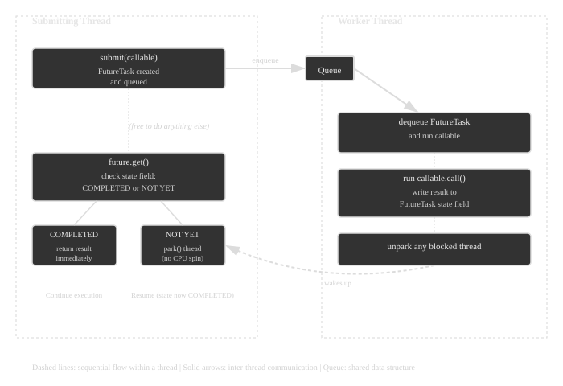

# Executors and Thread Pools
## The need for pool
- Creating a new thread for every task can be expensive in terms of system resources and time. Thread pools allow for reusing existing threads, which can improve performance and resource management.
- A wallet API handling 5,000 requests a second cannot create a thread per request — that is half a second of pure thread-creation overhead per second of traffic, and 5 GB of stacks (100 µs and 1MB per thread).

### Abstraction 
- The `Executor` interface provides a high-level abstraction for managing and executing tasks asynchronously. It decouples task submission from the mechanics of how each task will be run, including details of thread use, scheduling, etc.

```java
public interface Executor {
    void execute(Runnable command);
}
```

### ExecutorService 
- ExecutorService is what we actually use 
- Extends Executor with lifecycle and result-handling:
```java
public interface ExecutorService extends Executor {
    <T> Future<T> submit(Callable<T> task);
    Future<?> submit(Runnable task);
    <T> List<Future<T>> invokeAll(Collection<? extends Callable<T>> tasks);
    void shutdown();
    List<Runnable> shutdownNow();
    boolean awaitTermination(long timeout, TimeUnit unit);
}
```

### `Callable<T>` vs `Runnable`
```java
Runnable r = () -> System.out.println("no result, no checked exception");
Callable<Integer> c = () -> {
    return 42; // can return a value, can throw checked exceptions
};
```

### `Future<T>`
A handle to a result that will be available later:
```java
Future<Integer> future = executorService.submit(c);
Integer result = future.get(); // blocks until done
future.cancel(true);           // attempt to cancel
future.isDone();
```

### Creating Thread Pools: `Executors` Factory Methods
```java
ExecutorService fixed    = Executors.newFixedThreadPool(4);
ExecutorService cached   = Executors.newCachedThreadPool();
ExecutorService single   = Executors.newSingleThreadExecutor();
ScheduledExecutorService sched = Executors.newScheduledThreadPool(2);
ExecutorService virtual  = Executors.newVirtualThreadPerTaskExecutor(); // Java 21+
```

| Type                                | Threads                                               | Queue                           | Use case                                            |
|-------------------------------------|-------------------------------------------------------|---------------------------------|-----------------------------------------------------|
| `newFixedThreadPool(n)`             | Fixed `n`                                             | Unbounded `LinkedBlockingQueue` | Known, steady workload; CPU-bound tasks             |
| `newCachedThreadPool()`             | Grows unbounded, reuses idle threads (60s keep-alive) | `SynchronousQueue` (no queuing) | Bursty, short-lived tasks                           |
| `newSingleThreadExecutor()`         | 1                                                     | Unbounded queue                 | Sequential task execution; guarantees order         |
| `newScheduledThreadPool(n)`         | Fixed `n`                                             | Delay queue                     | Periodic/delayed tasks (like a `Timer`, but better) |
| `newWorkStealingPool()`             | `ForkJoinPool` based; parallelism = CPU cores         | Work-stealing deques            | Many small, independent, recursive tasks            |
| `newVirtualThreadPerTaskExecutor()` | Unbounded virtual threads                             | N/A                             | I/O-bound tasks at massive scale (Java 21+)         |

- Executors.newFixedThreadPool / newCachedThreadPool use unbounded queues or unbounded thread creation, which can hide bugs and cause OutOfMemoryError under load. 
- This is why Java's own documentation and tools like SpotBugs/Effective Java (Item 80) recommend constructing ThreadPoolExecutor directly in production code.


### The Real Engine: `ThreadPoolExecutor`
- This is what actually backs most of those factory methods. Understanding its constructor is understanding thread pools:
```java
public ThreadPoolExecutor(
    int corePoolSize,          // threads kept alive even when idle
    int maximumPoolSize,       // max threads allowed
    long keepAliveTime,        // idle timeout for threads beyond core
    TimeUnit unit,
    BlockingQueue<Runnable> workQueue,   // holds pending tasks
    ThreadFactory threadFactory,          // customize thread creation
    RejectedExecutionHandler handler      // what to do when saturated
)
```

**How a task flows through it (this is the key mental model):**
```
submit(task)
   │
   ▼
1. Is a core thread free? ──yes──► run task on it
   │no
   ▼
2. Is the queue not full? ──yes──► enqueue task (wait for a core thread)
   │no
   ▼
3. Is pool below maximumPoolSize? ──yes──► create a new (non-core) thread, run task
   │no
   ▼
4. Reject the task (RejectedExecutionHandler)
```

- This order surprises people: the pool does NOT grow to maximumPoolSize before filling the queue. 
- It only creates extra threads once the queue is full. 
- This is why newFixedThreadPool (unbounded queue) never actually uses more than corePoolSize threads — the queue absorbs everything first.

**Example: a properly bounded, production-style pool**
```java
ThreadPoolExecutor executor = new ThreadPoolExecutor(
    4,                                  // core threads
    8,                                  // max threads
    60L, TimeUnit.SECONDS,              // keep-alive for extra threads
    new ArrayBlockingQueue<>(100),      // bounded queue — prevents OOM
    new ThreadFactory() {
        private final AtomicInteger count = new AtomicInteger();
        public Thread newThread(Runnable r) {
            Thread t = new Thread(r, "worker-" + count.incrementAndGet());
            t.setDaemon(false);
            return t;
        }
    },
    new ThreadPoolExecutor.CallerRunsPolicy() // backpressure strategy
);
```

`RejectedExecutionHandler` policies (what happens when saturated):

| Policy                  | Behavior                                                             |
|-------------------------|----------------------------------------------------------------------|
| `AbortPolicy` (default) | Throws `RejectedExecutionException`                                  |
| `CallerRunsPolicy`      | Caller thread runs the task itself (natural backpressure/throttling) |
| `DiscardPolicy`         | Silently drops the task                                              |
| `DiscardOldestPolicy`   | Drops the oldest queued task, then retries                           |

### Choosing the Right Queue

| Queue                             | Behavior                                                                                       |
|-----------------------------------|------------------------------------------------------------------------------------------------|
| `LinkedBlockingQueue` (unbounded) | Never rejects; risk of unbounded growth                                                        |
| `ArrayBlockingQueue` (bounded)    | Fixed capacity; forces rejection/backpressure decisions                                        |
| `SynchronousQueue`                | No storage — direct hand-off; forces immediate thread creation (used by `newCachedThreadPool`) |
| `PriorityBlockingQueue`           | Executes higher-priority tasks first (tasks must be `Comparable`)                              |

### Submitting Work: `execute` vs `submit` vs `invokeAll`/`invokeAny`
```java
// execute: fire-and-forget, exceptions go to UncaughtExceptionHandler
executor.execute(() -> System.out.println("run"));

// submit: get a Future back, exceptions captured in the Future
Future<Integer> f = executor.submit(() -> 42);

// invokeAll: run a batch, block until ALL complete
List<Callable<Integer>> tasks = List.of(() -> 1, () -> 2, () -> 3);
List<Future<Integer>> results = executor.invokeAll(tasks);

// invokeAny: block until ANY ONE completes successfully, cancel the rest
Integer fastest = executor.invokeAny(tasks);
```

**Gotcha:** 
- With `execute()`, an uncaught exception in the task kills silently (goes to the thread's uncaught exception handler, thread pool creates a replacement thread). 
- With `submit()`, the exception is swallowed into the Future — you only see it when you call future.get(), which throws ExecutionException wrapping the real cause.

```java
Future<?> f = executor.submit(() -> { throw new RuntimeException("boom"); });
try {
    f.get();
} catch (ExecutionException e) {
    e.getCause(); // the actual RuntimeException("boom")
}
```

### Shutting Down Properly
```java
executor.shutdown(); // stop accepting new tasks, let queued tasks finish
try {
    if (!executor.awaitTermination(30, TimeUnit.SECONDS)) {
        executor.shutdownNow(); // interrupt running tasks
    }
} catch (InterruptedException e) {
    executor.shutdownNow();
    Thread.currentThread().interrupt();
}
```
- `shutdown()` vs `shutdownNow()`: 
  - `shutdown()` stops accepting new tasks and lets existing tasks finish.
  - `shutdownNow()` attempts to stop all running tasks immediately (interrupts them) and returns a list of tasks that were awaiting execution.
- Forgetting to shut down an executor is a classic resource leak — threads keep the JVM alive.

## Sizing the Pool: CPU-bound vs I/O-bound
### CPU-bound tasks
- heavy computation, no blocking
- For this type, the optimal number of threads is usually equal to the number of available CPU cores. (```optimal threads ≈ number of CPU cores (+1)```)
- More threads than cores can lead to context switching overhead.
- The +1 covers the occasional page fault or brief block.

```java
int cores = Runtime.getRuntime().availableProcessors();
ExecutorService cpuPool = Executors.newFixedThreadPool(cores + 1);
```

### I/O-bound tasks
- tasks that spend time waiting for external resources (disk, network, database)
- For I/O-bound tasks, you can have more threads than CPU cores because while some threads are blocked waiting for I/O, others can run. The optimal number of threads can be calculated using the formula:
```
optimal threads ≈ cores × (1 + waitTime / computeTime)
```
- For example, if you have 4 cores and your tasks spend 90% of their time waiting for I/O (waitTime = 0.9, computeTime = 0.1), the optimal number of threads would be:
```
// Example: tasks spend 90% time waiting, 10% computing
// ratio = wait/compute = 9 → threads ≈ cores * 10 ≈ 40 threads
```

**Modern alternative for I/O-bound work (Java 21+)**
- Use virtual threads instead of tuning a traditional pool at all:
```java
try (var executor = Executors.newVirtualThreadPerTaskExecutor()) {
    for (int i = 0; i < 100_000; i++) {
        executor.submit(() -> callSlowApi());
    }
}
```
- Virtual threads are cheap (JVM-managed, not OS threads), so you don't need to size a pool for blocking I/O — you can have one virtual thread per task and let blocking calls yield naturally.

### ScheduledExecutorService
- Replaces Timer/TimerTask (which has a single thread and dies entirely if a task throws)
- For tasks that need to run after a delay or periodically, use `ScheduledExecutorService`:
```java
ScheduledExecutorService scheduler = Executors.newScheduledThreadPool(2);

// run once, after a delay
scheduler.schedule(() -> System.out.println("once"), 5, TimeUnit.SECONDS);

// run repeatedly, fixed delay between END of one run and START of next
scheduler.scheduleWithFixedDelay(task, 0, 10, TimeUnit.SECONDS);

// run repeatedly, fixed rate between START of each run (may overlap if task is slow)
scheduler.scheduleAtFixedRate(task, 0, 10, TimeUnit.SECONDS);
```

## Common Pitfalls
- **Using unbounded queues with fixed thread pools**: can lead to resource exhaustion if tasks pile up faster than they can be processed. Always consider a bounded queue + rejection policy.
- **Blocking calls inside a small CPU-bound pool** → starves the pool; if a task blocks (I/O, Thread.sleep, lock wait), it occupies a worker thread doing nothing useful.
- **Not handling exceptions** in tasks can lead to silent failures. Always consider using `submit()` and checking the `Future` for exceptions.
- **Swallowed exceptions** via execute() with no uncaught-exception handler, or via unchecked Futures that are never .get()'d.
- **Not shutting down executors** can lead to resource leaks and prevent the JVM from exiting, especially in short-lived apps or tests.
- **Using Executors.newFixedThreadPool blindly** without knowing it hides an unbounded queue — same for newCachedThreadPool hiding unbounded thread growth.
- **Task dependencies causing deadlock**: submitting a task to a pool that itself submits and waits (get()) on another task in the same fixed-size pool can deadlock if all threads are stuck waiting.

## Quick Reference: Which Executor for Which Job:

| Scenario                                       | Recommended                                                                 |
|------------------------------------------------|-----------------------------------------------------------------------------|
| CPU-bound parallel computation                 | `newFixedThreadPool(cores)` or `ForkJoinPool`                               |
| I/O-bound, moderate concurrency                | Custom `ThreadPoolExecutor` with bounded queue, sized by wait/compute ratio |
| I/O-bound, massive concurrency (Java 21+)      | `newVirtualThreadPerTaskExecutor()`                                         |
| Sequential/ordered task execution              | `newSingleThreadExecutor()`                                                 |
| Periodic/delayed jobs                          | `newScheduledThreadPool()`                                                  |
| Recursive divide-and-conquer (e.g. merge sort) | `ForkJoinPool` / `newWorkStealingPool()`                                    |
| Unpredictable bursty short tasks               | `newCachedThreadPool()` (careful with unbounded growth)                     |

## Miscellaneous
### Future
**How `future` returns a value**:
- We know `run` is at the bottom of the stack and doesn't return anything, run() really does return void — the worker thread's stack frame still vanishes normally.
- But before it vanishes, it writes the result into a field on the FutureTask object (a heap object both threads can see).
The submitting thread reads that field later via get().

**How Future actually works**:
- `FutureTask` implements `RunnableFuture`, which is both a `Runnable` (so it can be executed by a thread) and a `Future` (so it can return a result).

- Think of `FutureTask` as a box with a lock:

- Internally, `FutureTask` uses a `volatile int state` field (values like NEW, COMPLETING, NORMAL, EXCEPTIONAL) plus Unsafe/VarHandle-based CAS operations and a wait-queue (built on the same park/unpark primitives as AbstractQueuedSynchronizer). This gives:
  - Visibility: the `volatile` write in the worker thread is guaranteed visible to the reading thread once observed.
  - Blocking without busy-waiting: `get()` calls `LockSupport.park()` if the result isn't ready — the calling thread literally goes to sleep (no CPU burned), and the worker thread calls `LockSupport.unpark()` on it after `set(result)`.

- The submitting thread and the worker thread communicate via a shared object (the FutureTask). The worker thread executes the task and stores the result in the FutureTask. The submitting thread can call get() on the FutureTask, which will block until the result is available. This is a simple producer-consumer model where the FutureTask acts as a mailbox for the result.

**Before waiting on result we can do something else**:
```java
Future<Integer> future = executor.submit(() -> slowComputation()); // returns IMMEDIATELY

doSomethingElseThatTakesTime();   // <-- runs concurrently with slowComputation()
doAnotherThing();

Integer result = future.get();    // blocks ONLY if slowComputation() hasn't finished yet
```

### ThreadFactory
**What it is:** A strategy interface the pool calls whenever it needs to spin up a *new* worker thread (not on every task — only when growing the pool up to core/max size).

```java
public interface ThreadFactory {
    Thread newThread(Runnable r);
}
```

**Default:** `Executors.defaultThreadFactory()` — creates non-daemon, normal-priority threads named `pool-N-thread-M` (hence the generic names you see in stack traces).

**Why customize it:**
1. **Meaningful thread names** — `order-processor-3` instead of `pool-2-thread-7`; huge help when reading thread dumps/profiler output under load.
2. **Daemon vs non-daemon** — non-daemon (default) blocks JVM exit until done; daemon lets JVM exit without waiting — useful for background pools, risky if work must complete.
3. **Thread priority** — `setPriority()` as a (weak, OS-dependent) hint to deprioritize background/maintenance threads.
4. **Uncaught exception handling** — set `setUncaughtExceptionHandler()` per thread so exceptions from `execute()` (which aren't captured in a `Future`, unlike `submit()`) get logged instead of silently vanishing to `System.err`.
5. **Custom `ThreadGroup` / context class loader / `ThreadLocal` seeding** — niche, seen in app servers, plugin systems, legacy security-manager setups.
6. **Virtual threads (Java 21+)** — `Thread.ofVirtual().name("vt-", 0).factory()` gives you a `ThreadFactory` producing virtual threads with custom naming.

**Pitfalls:**
- Forgetting `setDaemon(false)` if hand-rolling → JVM may exit early, dropping queued work.
- Using plain `int++` instead of `AtomicInteger` for name counters → race condition since `newThread()` can be called concurrently.
- No `UncaughtExceptionHandler` + only using `execute()` → failures silently disappear.

**Sample Examples for Each ThreadFactory Setting**

**1. Meaningful thread names**
```java
ThreadFactory namedFactory = new ThreadFactory() {
    private final AtomicInteger counter = new AtomicInteger(1);
    public Thread newThread(Runnable r) {
        return new Thread(r, "order-processor-" + counter.getAndIncrement());
    }
};
// Thread dump now shows "order-processor-3" instead of "pool-2-thread-7"
```

**2. Daemon vs non-daemon**
```java
ThreadFactory daemonFactory = r -> {
    Thread t = new Thread(r);
    t.setDaemon(true);   // JVM can exit even if this thread is still running
    return t;
};

ThreadFactory nonDaemonFactory = r -> {
    Thread t = new Thread(r);
    t.setDaemon(false);  // JVM waits for this thread to finish before exiting
    return t;
};
```

**3. Thread priority**
```java
ThreadFactory lowPriorityFactory = r -> {
    Thread t = new Thread(r);
    t.setPriority(Thread.MIN_PRIORITY); // hint to OS scheduler — deprioritize
    return t;
};
```

**4. Uncaught exception handling**
```java
ThreadFactory loggingFactory = r -> {
    Thread t = new Thread(r);
    t.setUncaughtExceptionHandler((thread, ex) ->
        System.err.println("Uncaught in " + thread.getName() + ": " + ex));
    return t;
};

// Test it:
ExecutorService executor = Executors.newFixedThreadPool(2, loggingFactory);
executor.execute(() -> { throw new RuntimeException("boom"); });
// prints: Uncaught in Thread-0: java.lang.RuntimeException: boom
```

**5. Custom ThreadGroup / context class loader**
```java
ThreadFactory contextAwareFactory = new ThreadFactory() {
    private final ThreadGroup group = new ThreadGroup("plugin-workers");
    public Thread newThread(Runnable r) {
        Thread t = new Thread(group, r);
        t.setContextClassLoader(pluginClassLoader); // e.g. app server / plugin system
        return t;
    }
};
```

**6. Virtual threads (Java 21+)**
```java
ThreadFactory virtualFactory = Thread.ofVirtual().name("vt-", 0).factory();
ExecutorService executor = Executors.newThreadPerTaskExecutor(virtualFactory);
// threads named vt-0, vt-1, vt-2 ... each a virtual thread
```

---

## Pitfalls — Shown in Code

**Forgetting `setDaemon(false)`**
```java
// BAD: if this pool is created with an implicit/default daemon setting
// and main() exits, queued tasks may never run
ThreadFactory risky = r -> {
    Thread t = new Thread(r);
    t.setDaemon(true); // unintentional — work could get dropped on JVM exit
    return t;
};
```

**Non-atomic counter (race condition)**
```java
// BAD
ThreadFactory buggy = new ThreadFactory() {
    private int counter = 1; // plain int, not thread-safe
    public Thread newThread(Runnable r) {
        return new Thread(r, "worker-" + counter++); // two threads could get same number
    }
};

// GOOD
ThreadFactory fixed = new ThreadFactory() {
    private final AtomicInteger counter = new AtomicInteger(1);
    public Thread newThread(Runnable r) {
        return new Thread(r, "worker-" + counter.getAndIncrement());
    }
};
```

**No exception handler + only `execute()` used**
```java
ExecutorService executor = Executors.newFixedThreadPool(2); // default factory, no handler
executor.execute(() -> { throw new RuntimeException("silently lost"); });
// exception goes to System.err via default handler, easy to miss in production logs
// unless you supply your own ThreadFactory with setUncaughtExceptionHandler (see #4 above)
```