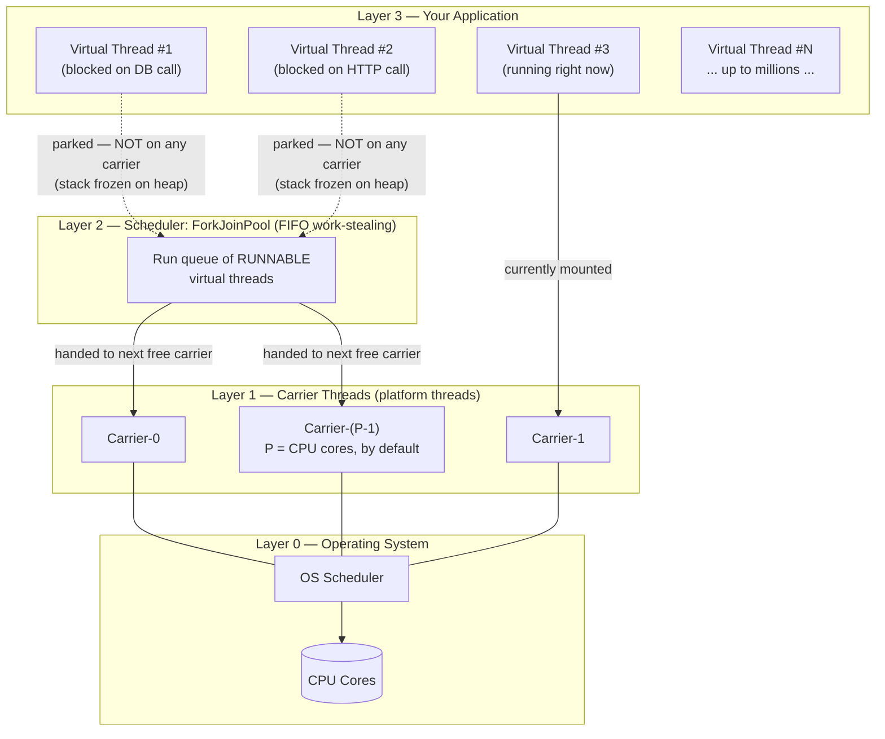
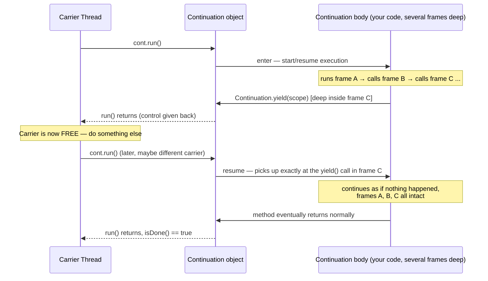
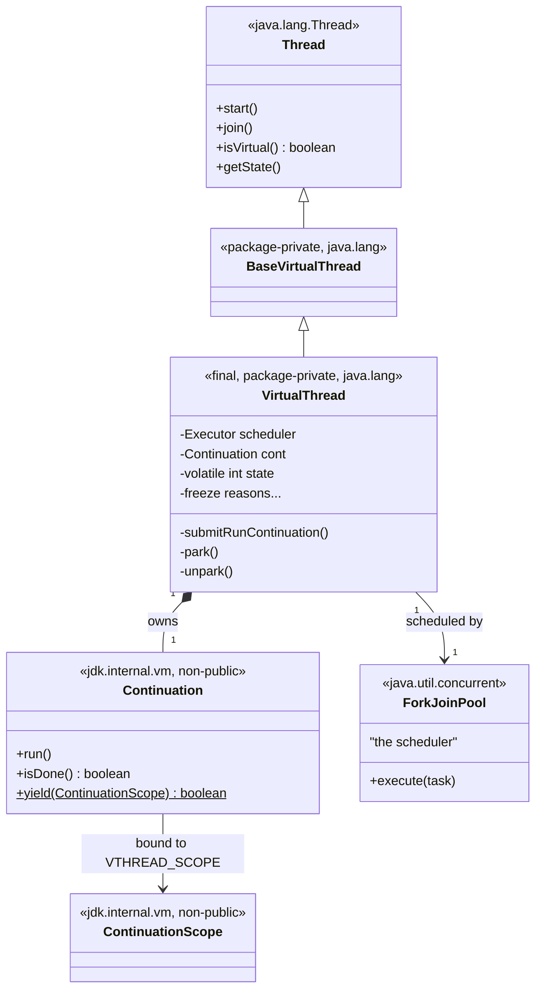
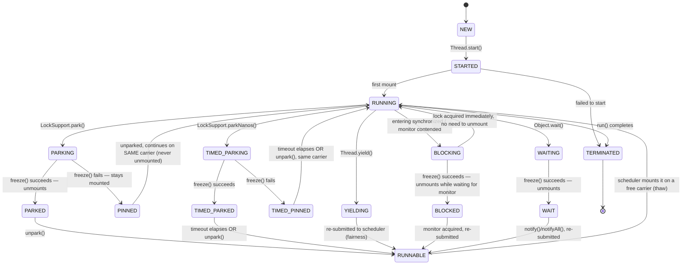
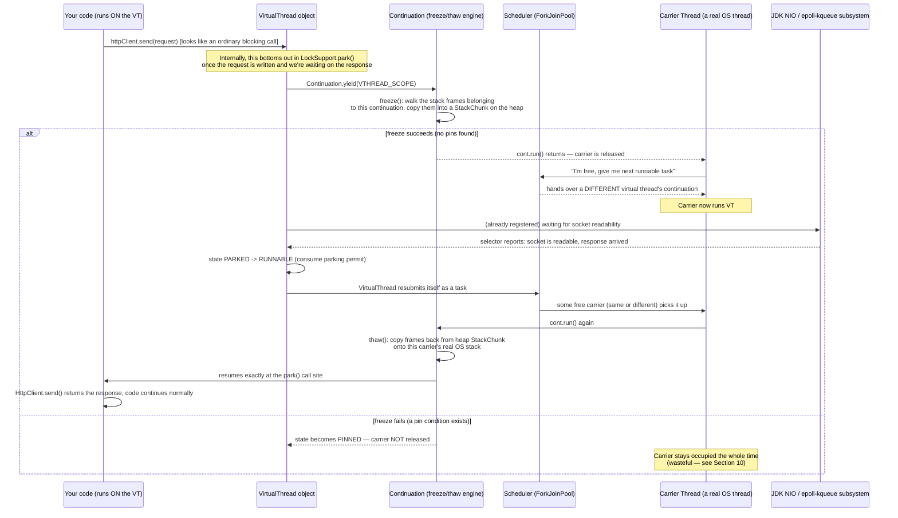

# Virtual Thread Internals: How Virtual Threads Work Alongside Carrier Threads

> A deep dive into the JVM machinery behind `java.lang.Thread.ofVirtual()` — continuations, freeze/thaw, scheduling, mounting, pinning, and how it all fits together.
>
> Based on the public OpenJDK/Project Loom design (JEP 425, JEP 444, JEP 491) and the `java.lang.VirtualThread` / `jdk.internal.vm.Continuation` implementation.

---

## Table of Contents

1. [The Big Picture](#1-the-big-picture)
2. [The Foundational Primitive: Continuations](#2-the-foundational-primitive-continuations)
3. [Anatomy of a Virtual Thread](#3-anatomy-of-a-virtual-thread)
4. [The Scheduler: ForkJoinPool as the M:N Engine](#4-the-scheduler-forkjoinpool-as-the-mn-engine)
5. [The Full State Machine](#5-the-full-state-machine)
6. [Mounting and Unmounting, Step by Step](#6-mounting-and-unmounting-step-by-step)
7. [Freeze: What Happens When a Virtual Thread Unmounts](#7-freeze-what-happens-when-a-virtual-thread-unmounts)
8. [Thaw: What Happens When a Virtual Thread Remounts](#8-thaw-what-happens-when-a-virtual-thread-remounts)
9. [A Worked Timeline: Two Virtual Threads, One Carrier](#9-a-worked-timeline-two-virtual-threads-one-carrier)
10. [Pinning: When Unmounting Isn't Possible](#10-pinning-when-unmounting-isnt-possible)
11. [JEP 491: Synchronized Without Pinning (JDK 24)](#11-jep-491-synchronized-without-pinning-jdk-24)
12. [Memory Model: Why Millions Are Possible](#12-memory-model-why-millions-are-possible)
13. [Observability: Seeing All This at Runtime](#13-observability-seeing-all-this-at-runtime)
14. [Tunable Knobs — Quick Reference](#14-tunable-knobs--quick-reference)
15. [How This Compares to Other M:N Models](#15-how-this-compares-to-other-mn-models)
16. [Mental Model Summary](#16-mental-model-summary)
17. [References](#17-references)

---

## 1. The Big Picture

Everything in this document boils down to one sentence:

> **A virtual thread is a unit of Java-level scheduling; a carrier thread is the OS-level vehicle that temporarily "carries" it.**

There are three distinct layers, and confusing them is the #1 source of misunderstanding virtual threads:

```
┌───────────────────────────────────────────────────────────────────────┐
│  LAYER 3 — Your Application                                           │
│  Millions of java.lang.Thread objects where isVirtual() == true       │
│  (VT-1, VT-2, VT-3, ... VT-N)                                         │
│  Each one is cheap: a Thread object + a Continuation + a tiny stack   │
└───────────────────────────────────────────────────────────────────────┘
                              │
                              │  scheduled onto  (JVM-level scheduling)
                              ▼
┌───────────────────────────────────────────────────────────────────────┐
│  LAYER 2 — The JDK's Virtual Thread Scheduler                         │
│  A java.util.concurrent.ForkJoinPool running in FIFO mode             │
│  Default size = Runtime.getRuntime().availableProcessors()            │
│  Work-stealing queues hand runnable virtual threads to free carriers  │
└───────────────────────────────────────────────────────────────────────┘
                              │
                              │  mounted onto  (temporary 1:1 pairing)
                              ▼
┌───────────────────────────────────────────────────────────────────────┐
│  LAYER 1 — Carrier Threads                                            │
│  A small, fixed-ish pool of ordinary java.lang.Thread objects where    │
│  isVirtual() == false — these ARE backed 1:1 by real OS threads        │
└───────────────────────────────────────────────────────────────────────┘
                              │
                              │  scheduled by the OS (kernel-level scheduling)
                              ▼
┌───────────────────────────────────────────────────────────────────────┐
│  LAYER 0 — Operating System Threads / CPU Cores                      │
└───────────────────────────────────────────────────────────────────────┘
```

So the famous "M:N" mapping is literally:

**M virtual threads : N carrier threads : N OS threads : (usually N ≈ number of CPU cores)**

The entire engineering trick is: **a virtual thread only occupies a carrier thread while it is actually running Java bytecode.** The instant it would otherwise *block* (I/O wait, `sleep`, lock wait, `park`), the JVM detaches it from the carrier so the carrier can go run a *different* virtual thread. This detach/reattach cycle is called **unmounting** and **mounting**, and it's built on top of a lower-level primitive called a **continuation**.



Keep this picture in your head for everything that follows: **most virtual threads, most of the time, own no carrier at all.** They exist only as frozen state sitting on the Java heap, waiting to be told "you're runnable again."

---

## 2. The Foundational Primitive: Continuations

Virtual threads are not a special-cased hack bolted onto `Thread`. They are built as a relatively thin layer on top of a much more general, lower-level JVM primitive introduced by Project Loom: **delimited continuations**, implemented internally as `jdk.internal.vm.Continuation` (and `jdk.internal.vm.ContinuationScope`). These classes are **not public API** — ordinary code never touches them directly — but understanding them is the key to understanding virtual threads, because `java.lang.VirtualThread` is, at its core, just:

```java
// Conceptual shape, not the literal source — but structurally accurate
final class VirtualThread extends BaseVirtualThread {

    private static final ContinuationScope VTHREAD_SCOPE =
        new ContinuationScope("VirtualThreads");

    private final Executor scheduler;      // the ForkJoinPool
    private final Continuation cont;       // <-- the engine
    private final Runnable runContinuation;

    VirtualThread(Executor scheduler, String name, Runnable task) {
        this.scheduler = scheduler;
        this.cont = new Continuation(VTHREAD_SCOPE, () -> {
            task.run();                     // your actual Runnable
        });
        this.runContinuation = this::runContinuation;
    }

    private void runContinuation() {
        cont.run();                         // mounts & executes (or resumes)
    }
}
```

A `Continuation` is essentially **a resumable function call** — a chunk of computation that can voluntarily suspend itself (`Continuation.yield(scope)`) at an arbitrary point deep in its call stack, hand control back to whoever invoked it (`cont.run()`), and later be resumed from *exactly* that point, as if nothing happened — including all local variables, nested method calls, and even state inside try/finally blocks.



This yield/resume capability is what makes "a blocking call doesn't block the carrier" possible at all: **blocking library code (socket reads, `Thread.sleep`, lock acquisition, etc.) has been rewritten inside the JDK to call `Continuation.yield(...)` instead of making a raw OS-level blocking call when it detects it's running on a virtual thread.**

### Why this is called "freeze" and "thaw"

Internally, the Loom engineers use more precise vocabulary than "yield"/"resume":

- **Freeze** = copying the in-flight stack frames of the continuation from the *carrier's real OS stack* onto the *Java heap* (so the carrier's stack is now clean and reusable).
- **Thaw** = copying those frames back from the heap onto *some* carrier's real OS stack so execution can continue.

The two "stacks" involved have their own jargon in the Loom design docs:

- **v-stack** ("vertical stack") — the normal OS-managed call stack of the carrier thread.
- **h-stack** ("horizontal stack") — the heap-allocated representation of a continuation's frames, stored as `StackChunk` objects (internally, arrays holding object references and primitive/metadata slots).

```
FREEZE (unmount)                                   THAW (mount)
─────────────────                                   ────────────

 Carrier OS Stack (v-stack)                     Carrier OS Stack (v-stack)
 ┌─────────────────────┐                        ┌─────────────────────┐
 │ frame: socket.read() │                        │ frame: socket.read() │ ◄─ resumes here
 │ frame: fetchOrders() │   copy frames    ──►    │ frame: fetchOrders() │
 │ frame: handle()      │   heap-ward             │ frame: handle()      │  ◄─ copied back
 │ frame: run()         │                        │ frame: run()         │
 └─────────────────────┘                        └─────────────────────┘
          │                                                ▲
          ▼                                                │
 ┌─────────────────────┐                        ┌─────────────────────┐
 │   StackChunk (heap)  │ ───────────────────►   │   StackChunk (heap)  │
 │  [obj refs][prims]    │   lives here while     │ (consumed / freed)   │
 └─────────────────────┘   the VT is parked      └─────────────────────┘
```

This copy is the real "cost" of a park/unpark cycle — it's cheap (memory copy, no syscall, no OS context switch) but not *free*. The JVM has fast-path/slow-path optimizations here (see §13's `ContinuationFreezeFast`/`ContinuationFreezeSlow` JFR events) — a shallow stack freezes almost instantly; a deep one costs proportionally more.

---

## 3. Anatomy of a Virtual Thread

Putting the pieces together, here's the structural relationship between the public API and the internal machinery:



Key points this diagram encodes:

- **`VirtualThread` *is-a* `Thread`.** That's deliberate: `Thread.currentThread()`, `ThreadLocal`, interrupt handling, uncaught exception handlers, thread names, stack traces — all the existing `Thread` API keeps working without modification. This is why migrating code to virtual threads is often just swapping the executor.
- **It *has-a* `Continuation`**, which is the actual engine that knows how to freeze/thaw its stack.
- **It *has-a* reference to its scheduler** (an `Executor`, almost always a `ForkJoinPool`) — this is what gets asked "please run me" every time the virtual thread becomes runnable again.
- A **volatile `int state`** field (with `compareAndSet` transitions) tracks exactly which lifecycle stage the virtual thread is in — this is the field behind `Thread.getState()` for a virtual thread, and it's the backbone of §5's state machine.

Because `VirtualThread` and `Continuation` are internal, non-public classes, **you never instantiate them yourself.** You always go through the public factory surface:

```java
Thread.ofVirtual().unstarted(task);          // → new VirtualThread(DEFAULT_SCHEDULER, ..., task)
Thread.ofVirtual().start(task);
Thread.startVirtualThread(task);
Executors.newVirtualThreadPerTaskExecutor(); // → an executor that calls the above per submitted task
```

---

## 4. The Scheduler: ForkJoinPool as the M:N Engine

The **default scheduler** for all virtual threads (unless you build a custom one) is a dedicated `java.util.concurrent.ForkJoinPool` instance, configured specially:

- It runs in **FIFO mode** rather than the LIFO/work-stealing-from-own-queue-end mode that `ForkJoinPool.commonPool()` normally uses for divide-and-conquer tasks. FIFO was chosen because virtual threads represent independent, typically-unrelated units of work (think: HTTP requests), and FIFO gives much fairer, more predictable latency than LIFO would for that workload shape.
- Its **target parallelism defaults to `Runtime.getRuntime().availableProcessors()`** — i.e., by default, roughly one carrier thread per CPU core.
- It uses **work-stealing**: each carrier (worker) thread has its own queue of runnable virtual-thread tasks; when a carrier's queue is empty, it "steals" work from another carrier's queue instead of sitting idle.

```
┌──────────────────────────────── ForkJoinPool (the scheduler) ────────────────────────────────┐
│                                                                                                 │
│   Carrier-0 queue        Carrier-1 queue        Carrier-2 queue        Carrier-3 queue          │
│   ┌───┬───┬───┐          ┌───┬───┐              ┌───┬───┬───┬───┐      ┌───┐                    │
│   │VT │VT │VT │          │VT │VT │              │VT │VT │VT │VT │      │ ∅ │ ← empty!           │
│   └───┴───┴───┘          └───┴───┘              └───┴───┴───┴───┘      └───┘                    │
│                                                                           ▲                      │
│                                                                           │ steals from Carrier-2 │
│                                                                           │ (work-stealing)       │
└───────────────────────────────────────────────────────────────────────────────────────────────┘
```

When a virtual thread transitions to **runnable** (freshly started, or waking up from a park), the `VirtualThread` object itself is submitted to this pool as a task (essentially: "please call `cont.run()` on me on whichever carrier is free next"). The pool's scheduling logic decides *which* carrier picks it up — there is **no guarantee it's the same carrier it ran on before.** A virtual thread might run on Carrier-0, park, and resume 50ms later on Carrier-2. This is intentional and is exactly how the pool keeps load balanced.

### Blocking operations and the carrier pool

Because the scheduler is itself just a `ForkJoinPool`, and `ForkJoinPool` already has logic to temporarily grow its worker count when tasks call `ForkJoinPool.ManagedBlocker`-style blocking operations, the virtual-thread scheduler inherits a safety valve: if *every* carrier becomes genuinely stuck (e.g., all pinned — see §10), the pool can spin up additional helper carrier threads so the system doesn't deadlock outright. This is a last-resort mechanism, not the primary scalability strategy — the primary strategy is "don't block carriers in the first place" via unmounting.

---

## 5. The Full State Machine

The actual internal state constants (from `java.lang.VirtualThread`, mirrored in the HotSpot C++ side in `javaClasses.hpp`) are richer than the simplified "mounted/unmounted" story usually told. Here is the real state set:

| State | Meaning |
|---|---|
| `NEW` | Created, not yet started |
| `STARTED` | `start()` called, submitted to scheduler, not yet run for the first time |
| `RUNNING` | Mounted on a carrier, actively executing bytecode |
| `PARKING` | In the middle of attempting to park (about to freeze) |
| `PARKED` | Freeze succeeded — fully unmounted, stack sitting on the heap, waiting indefinitely for `unpark()` |
| `PINNED` | Freeze **failed** — parked, but could **not** unmount; still occupying its carrier |
| `TIMED_PARKING` / `TIMED_PARKED` / `TIMED_PINNED` | Same as above, but for `parkNanos(duration)` — a timer will also wake it |
| `UNPARKED` | Woken up (permit consumed), waiting to be rescheduled |
| `YIELDING` / `YIELDED` | Mid-`Thread.yield()` — voluntarily giving up the carrier without actually blocking on anything |
| `BLOCKING` / `BLOCKED` / `UNBLOCKED` | Specific to monitor (`synchronized`) acquisition path |
| `WAITING` / `WAIT` / `TIMED_WAITING` / `TIMED_WAIT` | `Object.wait()` / timed `Object.wait()` |
| `TERMINATED` | `run()` completed — final state |
| `RUNNABLE` | Sitting in the scheduler's queue, eligible to be mounted, not yet mounted |
| *(internal bit)* `SUSPENDED` | OR'd onto another state when a debugger/JVMTI agent has suspended the thread while it was unmounted |



The important high-level takeaway: **`PARKED`, `TIMED_PARKED`, `BLOCKED`, and `WAIT` are all "fully unmounted" states** — the virtual thread owns zero carrier threads while in any of them. **`PINNED` and `TIMED_PINNED` are the exception** — these states mean the virtual thread *wanted* to unmount but couldn't, and is parked while still squatting on its carrier (covered in depth in §10).

---

## 6. Mounting and Unmounting, Step by Step

Let's trace exactly what happens, end-to-end, for one concrete blocking call: a virtual thread doing a blocking-style `HttpClient` call (which internally uses NIO + a virtual-thread-aware park under the hood).



Everything in the "freeze succeeds" branch above happens **transparently** — nothing in `App`'s code changes. The call `httpClient.send(request)` simply "takes a while to return," exactly like it always did on a platform thread. The only difference invisible to the application is that the *carrier thread underneath got reused by someone else* during the wait.

---

## 7. Freeze: What Happens When a Virtual Thread Unmounts

"Freeze" is the technical name for the unmount operation. Mechanically:

1. The JVM walks the continuation's portion of the call stack, frame by frame, starting from the innermost frame (where `Continuation.yield()` was invoked) outward, up to (but not including) the carrier's own driving frame (`Continuation.enter`/`cont.run()`).
2. For each frame, it copies: the frame's local variables, operand stack contents, and metadata (return address / bytecode index to resume at) into a heap-allocated **`StackChunk`** — essentially two parallel arrays, one for object references (so the GC can find and update them if objects move) and one for raw/primitive values and bookkeeping metadata.
3. Once every frame belonging to the continuation has been copied, the carrier's real OS stack is unwound back down to where it was before the continuation was entered — the carrier's stack is now "clean."
4. `cont.run()` returns `false`/control returns to the scheduler's driver loop, and that carrier thread is now completely free to pick up unrelated work.

There are two cost tiers here, visible via JFR (`jdk.ContinuationFreezeFast` vs `jdk.ContinuationFreezeSlow`):

- **Fast path**: the common case, optimized machine code for straightforward frames.
- **Slow path**: triggered by less common situations (e.g., certain interpreter frames, or frames requiring extra bookkeeping) — still correct, just more expensive.

### When freeze can fail: pinning

Freeze is not always possible. If, anywhere in the continuation's current call stack, there is a condition the JVM cannot safely "lift" off the carrier, freeze **aborts**, and the thread is marked **`PINNED`** instead of **`PARKED`** — meaning it still *looks* parked from the application's point of view (the blocking call doesn't return yet), but the carrier thread is **not released**. Section 10 covers this in detail.

---

## 8. Thaw: What Happens When a Virtual Thread Remounts

"Thaw" is the mirror image of freeze, and happens when a parked/runnable virtual thread is picked up by (any) carrier thread to resume execution:

1. The scheduler hands the virtual thread's continuation to a carrier thread that has capacity.
2. The JVM copies the frames back out of the heap-resident `StackChunk`(s) onto that carrier's real OS stack — restoring local variables, operand stacks, and resume points exactly as they were frozen.
3. Execution resumes at precisely the bytecode instruction right after the original `Continuation.yield()` call — which, from the application's perspective, is "the blocking method call is about to return."
4. The thaw can also have a fast path and a slow path (`jdk.ContinuationThawFast` / `jdk.ContinuationThawSlow`), mirroring freeze's optimization tiers, plus an additional nuance: **thawing can be partial/lazy** in some JDK versions — only the frames immediately needed are thawed first, with deeper frames thawed on demand — as a further optimization to keep resume latency low for deep call stacks.

Crucially: **thaw does not require the same carrier that performed the freeze.** The `StackChunk` is just heap data; any carrier thread in the pool can pick it up and thaw it onto its own OS stack. This is precisely what enables the work-stealing load balancing described in §4.

---

## 9. A Worked Timeline: Two Virtual Threads, One Carrier

This is the picture that makes the whole system click. Imagine a **single carrier thread** (to keep it simple) and **two virtual threads**, VT-A and VT-B, each doing one blocking I/O call in the middle of otherwise-trivial work.

```
time ──────────────────────────────────────────────────────────────────────────────►

Carrier-0  [ VT-A running ]           [ VT-B running ]            [ VT-A running ]
  (1 OS    ├──────────────┤           ├──────────────┤            ├──────────────┤
  thread)  │              │           │              │            │
           │              ▼ freeze    │              ▼ freeze     │
           │        (VT-A parks on    │        (VT-B parks on     │
           │         DB call)         │         HTTP call)        │
           │                          │                           │
           │              VT-A is PARKED,        VT-B is PARKED,  │
           │              stack frozen on heap.  stack frozen.    │
           │              Owns ZERO carriers.     Owns ZERO carr. │
           │                                                      │
           └── scheduler picks next ──┘                           │
                runnable VT (= VT-B)                               │
                                       └── DB reply arrives for ───┘
                                           VT-A (async, via NIO/epoll,
                                           handled off-carrier) →
                                           VT-A becomes RUNNABLE →
                                           scheduler thaws VT-A back
                                           onto Carrier-0 (it happened
                                           to be free again)

Legend:
  [ VT-X running ]  = VT-X is MOUNTED on Carrier-0, actively executing
  (blank)           = Carrier-0 would be idle OR running yet another VT
  PARKED            = VT is unmounted; its state lives only on the Java heap
```

With just **one carrier thread**, this single OS thread manages to make progress on two logically-concurrent, blocking-style tasks, because at every point in time it's either actively running one of them or has handed itself to whichever one is actually ready to make progress. Scale this out: with **P carriers** (P = CPU cores by default) and **thousands or millions of virtual threads** mostly waiting on network/database/file I/O at any given instant, you get the headline result: **you can have 100,000+ concurrent "threads of control" serviced by a mere handful of real OS threads**, because at any instant only a tiny fraction of them are actually *running* — the rest are parked, costing nothing but a bit of heap memory.

---

## 10. Pinning: When Unmounting Isn't Possible

**Pinning** means: the virtual thread is logically blocked (it can't make progress yet), but the JVM could not freeze its stack, so it remains mounted — the carrier thread is stuck waiting right along with it, unable to serve any other virtual thread in the meantime. This defeats the entire scalability premise for however long the pin lasts.

### The two situations that cause pinning

```
┌─────────────────────────────────────────────────────────────────────────────┐
│  CAUSE 1 — synchronized (pre-JDK 24)                                        │
│                                                                              │
│  synchronized(lock) {                                                       │
│      result = blockingNetworkCall();   // <-- park attempted HERE           │
│  }                                                                          │
│                                                                              │
│  Why it pinned: monitor (synchronized) ownership was tracked by identifying │
│  the OS/carrier thread that acquired the lock, not the logical virtual      │
│  thread. Freezing would detach the virtual thread from that carrier while   │
│  the lock bookkeeping still pointed at the carrier — unsafe. So freeze       │
│  refused, and the thread stayed PINNED to let the lock's invariants hold.   │
│  FIXED by JEP 491 in JDK 24 — see Section 11.                               │
├─────────────────────────────────────────────────────────────────────────────┤
│  CAUSE 2 — a native frame on the stack (still true today)                   │
│                                                                              │
│  Java code → JNI native method → native code calls back into Java →        │
│  that inner Java code tries to park/block                                  │
│                                                                              │
│  Why it pins: the JVM's freeze logic knows how to walk and relocate         │
│  ordinary interpreted/compiled Java frames, but it does NOT have a generic  │
│  way to suspend an arbitrary native (C/C++) stack frame sitting in between. │
│  If a native frame is present anywhere in the continuation's active stack, │
│  freeze aborts and the thread pins for as long as that native frame remains.│
└─────────────────────────────────────────────────────────────────────────────┘
```

### Why pinning is dangerous at scale

```
Normal (unmounted) blocking:                  Pinned blocking:

  Carrier-0 ── VT-A parks ──► FREE             Carrier-0 ── VT-A pins ──► STUCK
       │                                              │
       └─► picks up VT-B, VT-C, VT-D, ...             └─► cannot do anything else
           keeps serving new work                          until VT-A's pin clears

  1 carrier thread can service                 1 carrier thread services
  effectively unlimited parked VTs             exactly 1 VT while pinned

  ✅ scales                                     ⚠️  if enough VTs pin simultaneously,
                                                    every carrier can end up pinned →
                                                    starvation or deadlock (no carrier
                                                    left to run anything else)
```

If you have P carrier threads and P+1 virtual threads all simultaneously try to pin (e.g., all holding a contended `synchronized` block around a slow call, pre-JDK 24), you can starve the whole scheduler: there's no carrier left to make progress on anything.

### The historical workaround

Before JEP 491, the standard advice was: replace `synchronized` with `java.util.concurrent.locks.ReentrantLock` (or other `java.util.concurrent` locks) around any blocking call inside a critical section, because those locks' `park`/`unpark` plumbing was already virtual-thread-aware and did not pin.

```java
// Pre-JDK 24 recommended rewrite
private final ReentrantLock lock = new ReentrantLock();

lock.lock();
try {
    result = blockingNetworkCall();   // does NOT pin — freezes/unmounts normally
} finally {
    lock.unlock();
}
```

---

## 11. JEP 491: Synchronized Without Pinning (JDK 24)

JDK 24 largely eliminated **Cause 1** above. The re-architecture:

- Monitor (`synchronized`) ownership is now tracked by the **identity of the virtual thread itself**, not by the identity of whatever carrier happens to be running it at a given moment.
- This means a virtual thread can now **freeze and unmount while it is inside a `synchronized` block/method**, and while it's blocked trying to *enter* a contended monitor, and while it's suspended inside `Object.wait()` — all without pinning its carrier.
- The `synchronized` keyword itself didn't change semantically (mutual exclusion guarantees are identical) — what changed is purely the *internal bookkeeping* of who owns the lock, decoupling it from carrier identity.

```
JDK 21–23 behavior:                              JDK 24+ behavior (JEP 491):

synchronized(lock) {                             synchronized(lock) {
    slowBlockingCall();                              slowBlockingCall();
    // PINS the carrier the whole time                // Unmounts normally —
}                                                      // carrier is free during the call
                                                 }
```

Benchmarks cited alongside the JEP showed dramatic improvements for `synchronized`-heavy, virtual-thread-heavy workloads (legacy codebases using `synchronized` for connection pools, caches, etc.) — in some demonstrated cases, multi-second stalls collapsing to well under a second, simply by upgrading the JDK with no code changes.

**What JEP 491 does *not* fix:** pinning caused by a **native frame** on the stack (Cause 2) is explicitly out of scope — the JEP's own notes acknowledge a few exceptional scenarios will continue to pin. The `jdk.VirtualThreadPinned` JFR event remains relevant specifically for those native-call situations post-JDK 24.

**Practical upshot:** on JDK 24+ (and LTS release JDK 25), the long-standing advice "never use `synchronized` around blocking calls on virtual threads" can largely be relaxed — though auditing for JNI/native-call pinning is still worthwhile for latency-sensitive systems.

---

## 12. Memory Model: Why Millions Are Possible

| | Platform Thread | Virtual Thread |
|---|---|---|
| Backing | 1:1 real OS thread | No dedicated OS thread |
| Stack allocation | Fixed-size, reserved up front by the OS (historically ~1MB default, tunable via `-Xss`) | No fixed reservation — stack frames live in heap-allocated `StackChunk`s, sized to *actual* depth in use |
| Typical idle footprint | Full reserved stack + OS thread kernel data structures, whether "idle" (blocked) or not | A few hundred bytes to a few KB while parked — proportional to how deep the call stack actually is |
| Creation cost | Relatively expensive: OS syscall, memory mapping | Cheap: just a Java object allocation |
| Context switch cost | OS-level (kernel-mode transition, page table/TLB effects) | JVM-level stack copy (`freeze`/`thaw`) — no syscall, no privilege-level switch |
| Garbage collected? | No (OS-managed) | Yes — `StackChunk`s are ordinary (if special-cased) heap objects, scanned and relocatable by the GC like anything else |
| Practical ceiling | Thousands (OS/memory limits) | Millions (heap-memory limited, not OS-thread limited) |

This is the fundamental reason the "one virtual thread per request/task" style works at all: **the cost of a virtual thread while it's waiting is proportional to the size of its (usually small) suspended stack, not to a fixed, pre-reserved OS resource.** A thread pool of 200 platform threads reserves roughly 200MB of stack space whether those threads are busy or idle. A million parked virtual threads, by contrast, might collectively occupy only a few hundred MB — and that memory is reclaimable by ordinary GC once the threads terminate, rather than requiring explicit OS-level teardown.

---

## 13. Observability: Seeing All This at Runtime

### JDK Flight Recorder (JFR) events

| Event | Meaning |
|---|---|
| `jdk.VirtualThreadStart` | A virtual thread started running (disabled by default — high volume) |
| `jdk.VirtualThreadEnd` | A virtual thread finished (disabled by default) |
| `jdk.VirtualThreadPinned` | A virtual thread parked *while pinned* — enabled by default with a threshold (commonly ~20ms), because this is the event you actually care about diagnosing |
| `jdk.VirtualThreadSubmitFailed` | A virtual thread could not be started or unparked (e.g., scheduler rejected it) — enabled by default |
| `jdk.ContinuationFreeze` / `FreezeFast` / `FreezeSlow` | Unmount operations and their cost tier |
| `jdk.ContinuationThaw` / `ThawFast` / `ThawSlow` | Mount operations and their cost tier |

In practice, the single most useful one for debugging a "why is my virtual-thread app not scaling" problem is **`jdk.VirtualThreadPinned`** — it tells you exactly which stack was pinned, for how long, and (via the recorded stack trace) *where* in your code the pin occurred, so you can find the offending `synchronized` block or native call.

### `VirtualThreadSchedulerMXBean`

A management bean (`jdk.management:type=VirtualThreadScheduler`) exposes, live, at runtime:

- the scheduler's **target parallelism** (readable *and* dynamically settable — you can turn this dial while the JVM is running),
- the **current pool size** (platform threads currently used by the scheduler, whether mounted or idle),
- the **number of mounted virtual threads** (equal to how many carriers are currently busy),
- the **queue length** of virtual threads waiting for a carrier.

### Thread dumps

`jcmd <pid> Thread.dump_to_file -format=json <file>` produces a thread dump that **groups mounted virtual threads underneath the carrier thread currently running them**, and lists unmounted ones separately — this grouping exists specifically so a dump of an app with 500,000 virtual threads doesn't turn into an unreadable flat list; you see your small number of carriers, and which (if any) virtual thread each is currently carrying, plus the broader population of parked ones.

---

## 14. Tunable Knobs — Quick Reference

All of these are JVM **system properties** (set via `-Dproperty=value` on the command line) affecting the **default** scheduler. A custom scheduler (you can construct a virtual-thread factory with your own `Executor`) bypasses all of these.

| Property | Effect |
|---|---|
| `jdk.virtualThreadScheduler.parallelism` | Target number of carrier threads (default: `availableProcessors()`) |
| `jdk.virtualThreadScheduler.maxPoolSize` | Upper bound on carrier pool growth (e.g., for the ManagedBlocker-style safety valve) |
| `jdk.virtualThreadScheduler.minRunnable` | Minimum number of runnable carriers the scheduler tries to keep available |
| `jdk.virtualThreadScheduler.implClass` | Advanced: fully replace the default `ForkJoinPool`-based scheduler with your own class |

At runtime, target parallelism can also be adjusted dynamically without restarting, via the `VirtualThreadSchedulerMXBean` described above.

---

## 15. How This Compares to Other M:N Models

Virtual threads are Java's specific take on a pattern that appears, with different trade-offs, across the industry:

| System | M:N model | Blocking-call awareness |
|---|---|---|
| **Java virtual threads** | M virtual threads : N carrier (platform) threads, via `ForkJoinPool` | JDK-wide: standard blocking I/O, locks, and `sleep` are all natively virtual-thread-aware; ordinary synchronous code "just works" |
| **Go goroutines** | M goroutines : N OS threads, via the Go runtime scheduler | Built into the language/runtime from day one; the network poller integrates directly with the scheduler |
| **Kotlin coroutines** | Coroutines suspend via compiler-generated continuation-passing-style code, dispatched onto a thread pool (`Dispatchers.IO`, etc.) | Requires `suspend`-aware libraries; blocking a *regular* (non-suspending) call still blocks the underlying thread |
| **Erlang/BEAM processes** | Extremely lightweight, independently-scheduled "processes" (not OS threads at all), M:N onto OS schedulers | Native to the BEAM VM; message-passing and I/O are scheduler-aware by design |

Java's distinguishing choice is **API compatibility**: virtual threads reuse the *exact same* `Thread` class and the *exact same* blocking, synchronous style of I/O and locking that Java has always had — no new keyword (unlike Kotlin's `suspend`), no new language syntax, no separate "async" ecosystem to adopt. The cost of that choice is that the magic has to live deep inside the JDK's standard library implementations (socket I/O, `java.util.concurrent` locks, `Object.wait`) rather than being visible in your code at all.

---

## 16. Mental Model Summary

```
 ┌────────────────────────────────────────────────────────────────────┐
 │  1. A virtual thread is a Continuation + a bit of Thread-shaped     │
 │     bookkeeping (state, name, interrupt flag, etc).                 │
 │                                                                      │
 │  2. It is scheduled — not by the OS — but by a JDK-level             │
 │     ForkJoinPool (FIFO, work-stealing), onto a SMALL pool of         │
 │     "carrier" threads, which ARE real OS threads.                   │
 │                                                                      │
 │  3. "Mounted" = its stack frames currently live on a carrier's       │
 │     real OS stack, and it's actually executing.                     │
 │     "Unmounted / parked" = its stack frames have been FROZEN into    │
 │     a heap object (StackChunk); it owns zero OS resources.           │
 │                                                                      │
 │  4. Blocking calls throughout the JDK have been rewritten to         │
 │     trigger freeze+unmount instead of a raw OS blocking syscall,     │
 │     whenever they detect they're running on a virtual thread.        │
 │                                                                      │
 │  5. "Pinning" = freeze refused to happen (synchronized pre-JDK24,    │
 │     or a native frame on the stack) — the carrier stays stuck.       │
 │     JEP 491 (JDK 24) removed the synchronized case.                  │
 │                                                                      │
 │  6. Net effect: your code reads like ordinary sequential, blocking   │
 │     Java — because it IS ordinary sequential, blocking Java — but    │
 │     the JVM quietly multiplexes millions of these onto a handful     │
 │     of real threads, recycling carriers the instant anything would   │
 │     otherwise sit idle waiting on I/O.                               │
 └────────────────────────────────────────────────────────────────────┘
```

---

## 17. References

- JEP 425: Virtual Threads (Preview) — introduced the model (JDK 19)
- JEP 444: Virtual Threads — finalized (JDK 21)
- JEP 491: Synchronize Virtual Threads without Pinning (JDK 24)
- JEP 506: Scoped Values — finalized (JDK 25), the designed replacement for `ThreadLocal` in virtual-thread-heavy code
- `jdk.management.VirtualThreadSchedulerMXBean` Javadoc — runtime scheduler introspection/control
- OpenJDK Loom project wiki (`wiki.openjdk.org`) — design notes on `Continuation`, freeze/thaw, v-stack/h-stack terminology

*(JEP numbers and finalization releases are accurate as of this document's writing; always check `openjdk.org/jeps/<number>` for the authoritative, current status of any given JEP.)*